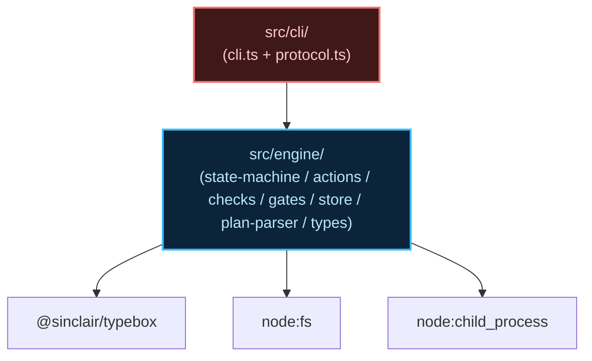
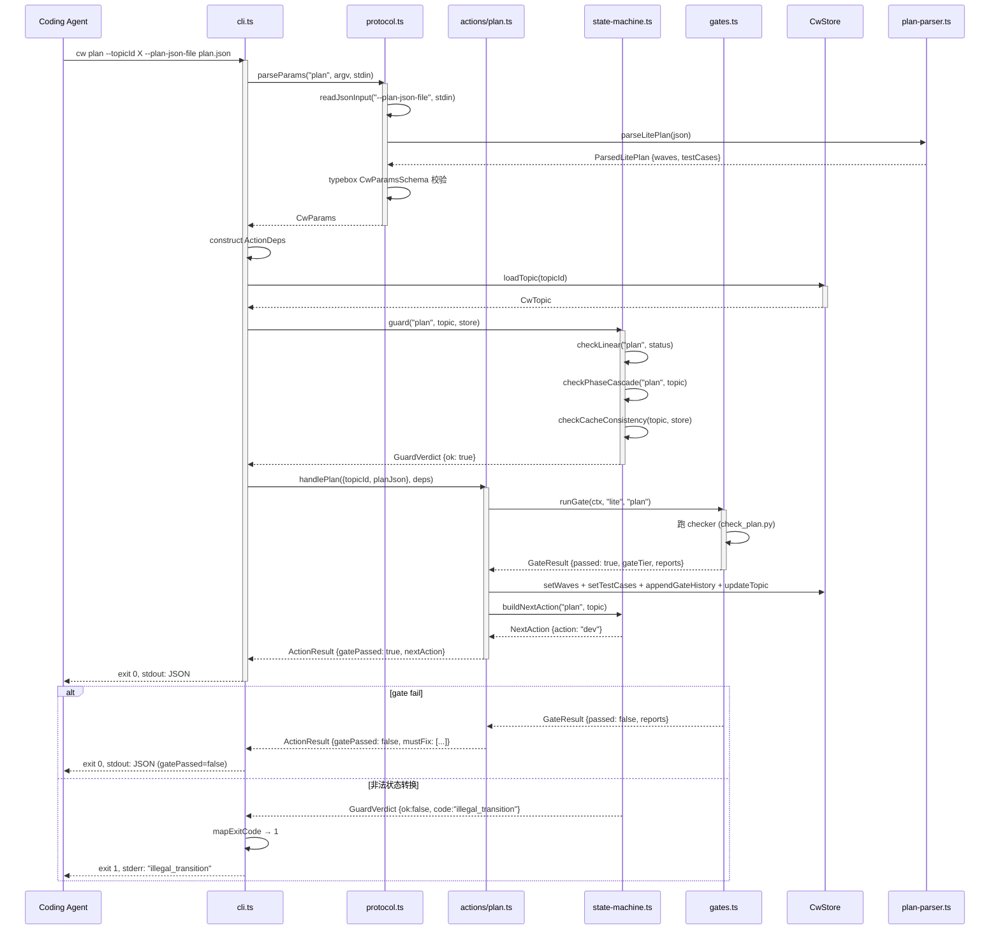
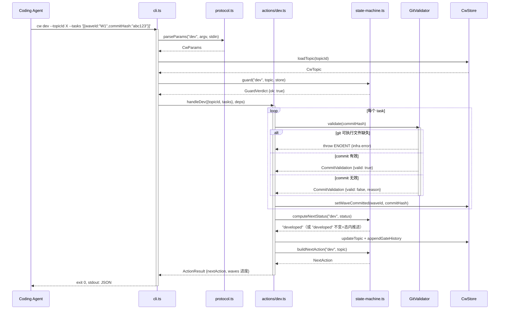
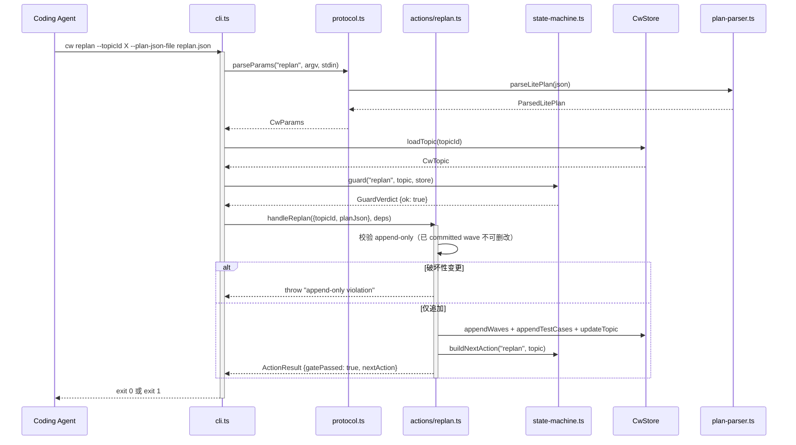
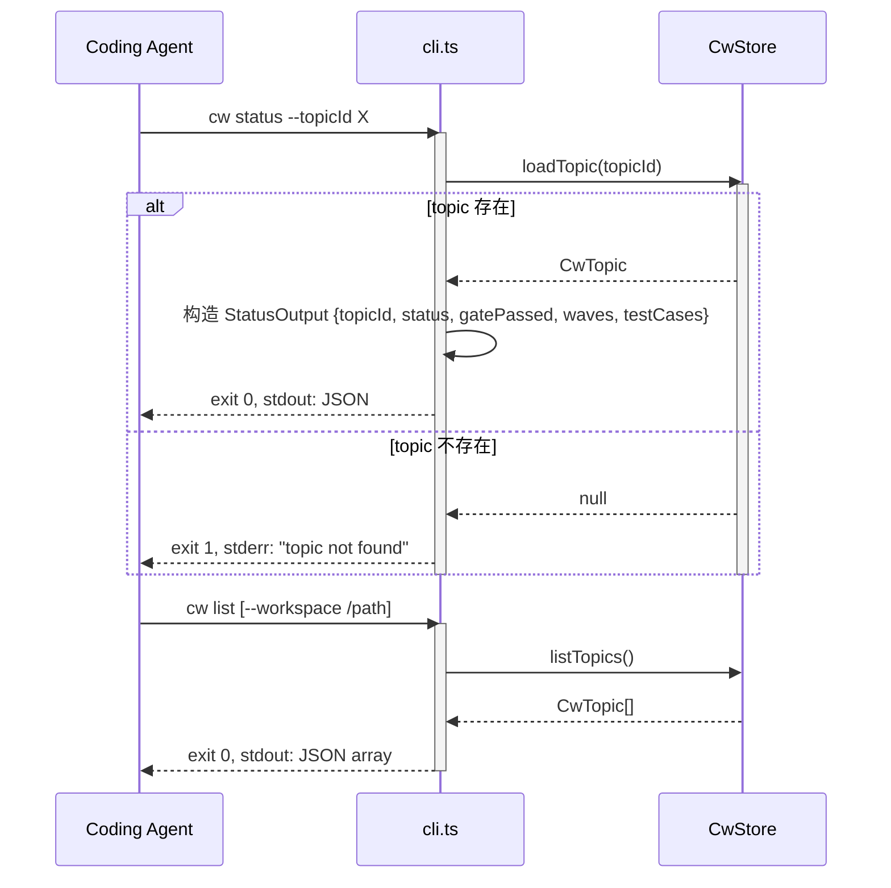

# 代码架构设计 — cw-cli-extract

## 1. 工程目录

```
@zhushanwen/coding-workflow/
├── package.json                  # bin: { cw: ./dist/cli/cli.js }
├── tsconfig.json
├── src/
│   ├── cli/                      # CLI 适配层（新建，替换 pi registerTool）
│   │   ├── cli.ts                # 入口：argv 解析 + action→handler 路由 + ActionDeps 构造 + exit code
│   │   └── protocol.ts           # 协议层：CwParamsSchema 信封 + typebox 校验 + stdin/文件读取 + 参数合并
│   └── engine/                   # Engine 核心层（搬迁，零改动）
│       ├── types.ts              # 共享类型 + judgeByExpected
│       ├── state-machine.ts      # 转换表 + 三重 guard + nextAction 组装
│       ├── store.ts              # CwStore（JSON 文件持久化 + 事务 + 文件锁）
│       ├── plan-parser.ts        # 3 套 JSON schema + 解析
│       ├── gates.ts              # GATE_REGISTRY + runGate + GateRunner + GitValidator
│       ├── checks/               # check 函数（TS 迁移自 python）
│       │   └── shared.ts         # CheckOutput 共享类型
│       └── actions/              # 9 个 handler
│           ├── create.ts
│           ├── plan.ts
│           ├── clarify.ts
│           ├── detail.ts
│           ├── dev.ts
│           ├── test.ts
│           ├── retrospect.ts
│           ├── closeout.ts
│           └── replan.ts
├── scripts/
│   └── verify-anti-patterns.sh   # 反模式验收脚本
└── tests/
    ├── engine/                   # 搬迁的 26 个 engine 单测（原样）
    └── cli-e2e/
        └── skeleton.test.ts      # CLI e2e 骨架
```

| 目录 | 职责 | 变化轴 | 依赖方向 |
|------|------|--------|---------|
| `src/cli/` | CLI 入口 + 协议校验 | 调用方式（CLI/MCP 未来） | → engine |
| `src/engine/` | 状态机 + gate + store + actions | 业务流程（稳定） | → node:fs, node:child_process, @sinclair/typebox |
| `tests/engine/` | engine 单测（等价验证） | 与 engine 同步 | → engine |
| `tests/cli-e2e/` | CLI 端到端测试 | CLI 协议 | → cli |
| `scripts/` | 反模式自动化验收 | 反模式清单 | → src/ |

## 2. 包依赖图



**Import 规则：**
- `src/cli/` → 可 import `src/engine/`（单向依赖）
- `src/engine/` → 不得 import `src/cli/`（engine 零 CLI 依赖）
- `src/engine/actions/*` → 可 import `../state-machine.js`、`../types.js`、`../store.js`、`../gates.js`、`../plan-parser.js`（与 pi 扩展一致）
- `src/engine/checks/*` → 可 import `./shared.js`、`../types.js`（与 pi 扩展一致）
- 运行时 import 图不得包含 `@mariozechner/pi-coding-agent` 或 `@earendil-works/pi-ai`

**循环依赖检测点：** cli → engine 单向，engine 内部 actions ↔ state-machine 已有（pi 扩展等价），无新增环。

## 3. API 契约

### 模块: src/cli/cli.ts

| 方法 | 签名 | 返回 | 边界条件 | Spec/Issue 关联 |
|------|------|------|---------|----------------|
| main | `(argv: string[]) → Promise<void>` | void（exit code + stdout/stderr 副作用） | argv 无 action → exit 1 + stderr | UC-1~4, #2 |
| mapExitCode | `(result: ActionResult \| Error) → number` | exit code 0 或 ≥1 | gate fail → 0；illegal_transition → 1；内部异常 → 2 | #7, C-1 |

### 模块: src/cli/protocol.ts

| 方法 | 签名 | 返回 | 边界条件 | Spec/Issue 关联 |
|------|------|------|---------|----------------|
| parseParams | `(action: CwAction, argv: minimist.ParsedArgs, stdinData: string) → CwParams` | 校验后的参数对象 | 缺必填字段 → throw；tier 锁定不符 → throw | #2, #6 |
| readJsonInput | `(flagValue?: string, stdinData: string, isStdinTTY: boolean) → unknown` | JSON 对象 | stdin + flag 同时存在 → throw ConflictError；stdin TTY 空 → fallback flag；都无 → throw | #4 |
| validateParams | `(raw: unknown) → CwParams` | typebox 校验后的 CwParams | schema 不匹配 → throw ValidationError | #5, #6 |
| CwParamsSchema | `Type.Object(...)` | typebox schema | — | #6 |
| resolveDbPath | `(workspacePath: string, cwHome?: string) → string` | `~/.cw/<encoded-cwd>/_cw.json` 路径 | CW_HOME 非绝对路径 → throw；`.cw-wt/` 检测 → throw | #3, C-2, C-3 |
| readJsonInput | `(flagValue?: string, stdinData: string, isStdinTTY: boolean) → unknown` | JSON 对象 | stdin + flag 同时存在 → throw ConflictError；stdin TTY 空 → fallback flag；都无 → throw | #4, NFR T7.6 |

### 模块: src/engine/types.ts（搬迁，零改动）

| 方法 | 签名 | 返回 | 边界条件 | Spec/Issue 关联 |
|------|------|------|---------|----------------|
| judgeByExpected | `(expected: Expected, actual: Actual) → {status, reason}` | passed/failed + reason | expected 无 judgeable 字段 → failed | UC-3, G3 |
| resolveTopicDir | `(topic: CwTopic) → string` | topicDir 路径 | topicDir 为空 → fallback join(workspacePath, slug) | UC-1 |

### 模块: src/engine/store.ts（搬迁，零改动）

| 方法 | 签名 | 返回 | 边界条件 | Spec/Issue 关联 |
|------|------|------|---------|----------------|
| CwStore.constructor | `(dbPath: string)` | — | 父目录不存在 → 自动 mkdirSync | #3 |
| CwStore.loadTopic | `(topicId: string) → CwTopic \| null` | topic 或 null | topicId 不存在 → null | UC-1~4 |
| CwStore.listTopics | `() → CwTopic[]` | 全部 topic | 空库 → [] | UC-4 |
| CwStore.insertTopic | `(topic: CwTopic) → void` | — | slug 重复 → throw PRIMARY KEY 冲突 | UC-1 |
| CwStore.transaction | `(fn: () => void) → void` | — | fn throw → ROLLBACK（内存副本丢弃） | UC-1~3 |

### 模块: src/engine/state-machine.ts（搬迁，零改动）

| 方法 | 签名 | 返回 | 边界条件 | Spec/Issue 关联 |
|------|------|------|---------|----------------|
| guard | `(action, topic, store) → GuardVerdict` | `{ok:true}` 或 `{ok:false, code, reason}` | 三重校验串行，fail 短路 | UC-1~6 |
| checkLinear | `(action, current) → GuardVerdict` | 同上 | current ∉ expectedStatuses → fail | UC-2 |
| checkPhaseCascade | `(action, topic) → GuardVerdict` | 同上 | requirePhaseComplete 未 gatePassed → fail | UC-3 |
| checkCacheConsistency | `(topic, store) → GuardVerdict` | 同上 | 缓存 ≠ 重算 → fail | UC-2 |
| computeNextStatus | `(action, current) → CwStatus` | 新状态 | progressive + 已达 nextStatus → 不流转 | UC-3 |
| buildNextAction | `(action, topic) → NextAction` | nextAction 含 guidance/skill/waves/testCases | gate fail → 指回本 action + mustFix guidance | UC-1~6 |

### 模块: src/engine/gates.ts（搬迁，零改动）

| 方法 | 签名 | 返回 | 边界条件 | Spec/Issue 关联 |
|------|------|------|---------|----------------|
| runGate | `(ctx, tier, phase) → GateResult` | `{passed, gateTier, reports}` | 全量跑完所有 checker，不 fail-fast | UC-2 |
| lookupGateTier | `(tier, phase) → GateTier` | gate tier 字符串 | — | UC-3 |
| GateRunner.runCheck | `(scriptPath, topicDir) → CheckOutput` | `{passed, report?, infraError?}` | 未知 key → infraError；crash → infraError | UC-2 |
| GitValidator.validate | `(commitHash) → CommitValidation` | 结构化结果 | not git repo → valid:false, reason 明确 | UC-3 |
| GitValidator.isAncestorOfAny | `(commitHash, ancestors) → boolean` | true/false | ancestors 空 → false | UC-3 |

### 模块: src/engine/plan-parser.ts（搬迁，零改动）

| 方法 | 签名 | 返回 | 边界条件 | Spec/Issue 关联 |
|------|------|------|---------|----------------|
| parseLitePlan | `(json: unknown) → ParsedLitePlan` | waves + testCases seed | format ≠ lite → throw；schema 不匹配 → throw | UC-2 |
| parseMidClarify | `(json: unknown) → ParsedMidClarify` | deliverables | format ≠ mid-clarify → throw | UC-2 |
| parseMidDetail | `(json: unknown) → ParsedMidDetail` | waves + testCases + deliverables | format ≠ mid-detail → throw | UC-2 |
| parseTestCaseSubmissions | `(json: unknown) → TestCaseSubmission[]` | cases 数组 | caseId 缺失 → throw | UC-3 |
| LitePlanSchema / MidClarifySchema / MidDetailSchema / TestCaseSubmissionSchema | typebox Type.Object | — | — | #6 |

### 模块: src/engine/actions/create.ts（搬迁，零改动）

| 方法 | 签名 | 返回 | 边界条件 | Spec/Issue 关联 |
|------|------|------|---------|----------------|
| handleCreate | `(params: CreateParams, deps: ActionDeps) → ActionResult` | ActionResult 含 topicId + nextAction | slug 重复 → throw PRIMARY KEY | UC-1 |
| buildTopicId | `(slug: string) → string` | `cw-YYYY-MM-DD-<slug>` | — | UC-1 |

### 模块: src/engine/actions/*（其他 8 个 handler，搬迁，签名一致）

| action handler | 签名 | 关联 |
|---------|------|------|
| handlePlan | `(params: PlanParams, deps: ActionDeps) → ActionResult` | UC-2 |
| handleClarify | `(params: ClarifyParams, deps: ActionDeps) → ActionResult` | UC-2 |
| handleDetail | `(params: DetailParams, deps: ActionDeps) → ActionResult` | UC-2 |
| handleDev | `(params: DevParams, deps: ActionDeps) → ActionResult` | UC-3 |
| handleTest | `(params: TestParams, deps: ActionDeps) → ActionResult` | UC-3 |
| handleRetrospect | `(params: RetrospectParams, deps: ActionDeps) → ActionResult` | UC-3 |
| handleCloseout | `(params: CloseoutParams, deps: ActionDeps) → ActionResult` | UC-2 |
| handleReplan | `(params: ReplanParams, deps: ActionDeps) → ActionResult` | UC-6 |

## 4. 功能代码链路（时序图）

### 4.1 UC-1: 启动 Topic（create）

```mermaid
sequenceDiagram
    participant Agent as Coding Agent
    participant CLI as cli.ts
    participant Proto as protocol.ts
    participant Create as actions/create.ts
    participant SM as state-machine.ts
    participant Store as CwStore

    Agent->>CLI: cw create --slug X --tier lite --objective "..." [--workspace /path]
    activate CLI
    CLI->>Proto: parseParams("create", argv, stdin)
    activate Proto
    Proto->>Proto: typebox CwParamsSchema 校验
    Proto->>Proto: resolveDbPath(workspacePath, CW_HOME)
    Proto-->>CLI: CwParams
    deactivate Proto
    CLI->>CLI: 构造 ActionDeps(store, git, runner, workspacePath)
    CLI->>Create: handleCreate({slug, tier, objective, workspacePath}, deps)
    activate Create
    Create->>SM: buildNextAction("create", topic)
    SM-->>Create: NextAction (action=plan/clarify)
    Create->>Store: insertTopic(topic)
    activate Store
    Store-->>Store: 事务内写入 _cw.json（temp+fsync+rename）
    Store-->>Create: void
    deactivate Store
    Create-->>CLI: ActionResult {topicId, status:"created", nextAction}
    deactivate Create
    CLI->>CLI: mapExitCode → 0
    CLI-->>Agent: stdout: JSON.stringify(ActionResult)
    deactivate CLI

    alt slug 重复
        Store-->>Create: throw PRIMARY KEY 冲突
        Create-->>CLI: throw
        CLI->>CLI: catch → mapExitCode → 1
        CLI-->>Agent: exit 1, stderr: "slug 已存在"
    end
```

#### 方法签名表

| 类 | 方法 | 签名 | 返回 | 边界条件 | Spec/Issue |
|----|------|------|------|---------|-----------|
| cli.ts | main | (argv) → Promise\<void\> | void | 无 action → exit 1 | UC-1 |
| protocol.ts | parseParams | (action, argv, stdin) → CwParams | CwParams | 缺 slug → throw | #2 |
| protocol.ts | resolveDbPath | (workspacePath, cwHome?) → string | 路径 | .cw-wt/ → throw | #3, C-3 |
| actions/create.ts | handleCreate | (params, deps) → ActionResult | ActionResult | slug 重复 → throw | UC-1 |
| state-machine.ts | buildNextAction | ("create", topic) → NextAction | NextAction | tier 分流 | UC-1 |
| store.ts | insertTopic | (topic) → void | void | PRIMARY KEY → throw | UC-1 |

#### 数据流链
Agent → cli.main(argv) → protocol.parseParams → protocol.resolveDbPath → construct ActionDeps → create.handleCreate → store.insertTopic + state-machine.buildNextAction → cli.mapExitCode → stdout JSON

#### 关联
- requirements: UC-1 (AC-1.1~1.3)
- issues: #1 方案A, #2 方案A, #3 方案A
- NFR: T7.1 (typebox 校验), T7.4 (路径穿越防护)

### 4.2 UC-2: 推进流程（plan, single-shot）



#### 方法签名表

| 类 | 方法 | 签名 | 返回 | 边界条件 | Spec/Issue |
|----|------|------|------|---------|-----------|
| protocol.ts | readJsonInput | (flag?, stdin, isStdinTTY) → unknown | JSON | stdin+flag 冲突 → throw | #4 |
| plan-parser.ts | parseLitePlan | (json) → ParsedLitePlan | waves+testCases | format≠lite → throw | UC-2 |
| state-machine.ts | guard | (action, topic, store) → GuardVerdict | verdict | 三重串行 | UC-2 |
| gates.ts | runGate | (ctx, tier, phase) → GateResult | passed+reports | 全量跑完 | UC-2 |
| actions/plan.ts | handlePlan | (params, deps) → ActionResult | ActionResult | gate fail → gatePassed=false | UC-2 |

#### 数据流链
Agent → cli.main → protocol.parseParams + protocol.readJsonInput → plan-parser.parseLitePlan → store.loadTopic → state-machine.guard → plan.handlePlan → gates.runGate → store.transaction(write) → state-machine.buildNextAction → cli → stdout JSON

#### 关联
- requirements: UC-2 (AC-2.1~2.4)
- issues: #2, #4, #5, #6, #7
- NFR: T7.1, T7.6, T7.9, T7.11

### 4.3 UC-3: 提交进度（dev, 渐进式）



#### 方法签名表

| 类 | 方法 | 签名 | 返回 | 边界条件 | Spec/Issue |
|----|------|------|------|---------|-----------|
| GitValidator | validate | (commitHash) → CommitValidation | 结构化结果 | ENOENT → throw；not git repo → valid:false | UC-3 |
| actions/dev.ts | handleDev | (params, deps) → ActionResult | ActionResult | commit 无效 → gate fail | UC-3 |
| state-machine.ts | computeNextStatus | (action, current) → CwStatus | 新状态 | progressive+已达 → 不流转 | UC-3 |

#### 数据流链
Agent → cli.main → protocol.parseParams → store.loadTopic → state-machine.guard → dev.handleDev → GitValidator.validate(per task) → store.setWaveCommitted → state-machine.buildNextAction → cli → stdout JSON

#### 关联
- requirements: UC-3 (AC-3.1~3.4)
- issues: #7
- NFR: T7.9, T7.11

### 4.4 UC-6: 追加计划（replan, append-only）



#### 方法签名表

| 类 | 方法 | 签名 | 返回 | 边界条件 | Spec/Issue |
|----|------|------|------|---------|-----------|
| actions/replan.ts | handleReplan | (params, deps) → ActionResult | ActionResult | 破坏性变更 → throw | UC-6, AC-6.2 |

#### 数据流链
Agent → cli.main → protocol.parseParams + readJsonInput → plan-parser.parseLitePlan → store.loadTopic → state-machine.guard → replan.handleReplan → append-only 校验 → store.appendWaves → state-machine.buildNextAction → cli → stdout JSON

#### 关联
- requirements: UC-6 (AC-6.1~6.3)
- issues: #1
- NFR: T7.9

### 4.5 UC-4: 查询状态（status/list, CLI 新增）



#### 方法签名表

| 类 | 方法 | 签名 | 返回 | 边界条件 | Spec/Issue |
|----|------|------|------|---------|-----------|
| cli.ts | handleStatus | (topicId, store) → StatusOutput | JSON | topicId 不存在 → exit 1 | UC-4 |
| cli.ts | handleList | (store) → CwTopic[] | JSON | 空库 → [] | UC-4 |

#### 关联
- requirements: UC-4 (AC-4.1~4.2)
- issues: #8 方案A

## 5. Deep Module 设计决策

### Module: dispatch（engine 入口）

- **Interface**: `dispatch(params: CwParams, deps: ActionDeps) → ActionResult`（注：pi 扩展无独立 dispatch 文件，CLI 适配层在 cli.ts 内 inline 路由到各 handler。新包可提取为 `src/engine/dispatch.ts` 统一入口）
- **Depth**: 深模块。caller 只需传 CwParams + ActionDeps，内部完成 guard + handler 分派 + gate 执行 + store 写入。Deletion test：去掉 dispatch，每个 CLI 子命令都要 inline guard + handler + store 调用——复杂度散布 9 处。
- **Seam**: ActionDeps 是真 seam（store/git/runner 注入，测试已用 mock）。dispatch 本身是假设 seam（当前单 CLI 实现）。
- **Port 决策**: ActionDeps 不抽象为 interface（TypeScript structural typing，对象字面量即满足）。MCP 落地时再评估。

### Module: protocol.ts（CLI 协议层）

- **Interface**: `parseParams(action, argv, stdin) → CwParams` + `readJsonInput(flag, stdin, isStdinTTY) → unknown`
- **Depth**: 深模块。caller 只传 argv 和 stdin 原始数据，内部完成 stdin/文件读取 + JSON 解析 + typebox 校验 + 参数合并。Deletion test：去掉 protocol.ts，cli.ts 每个子命令都要 inline JSON 读取 + 校验逻辑——重复 9 次。
- **Seam**: stdin/文件读取是内部 seam（测试可注入 mock stdin）。
- **Port 决策**: 不引入 port。protocol.ts 是 CLI 适配层的一部分，MCP 替换 cli.ts 时可复用 protocol.ts 的校验逻辑。

### Module: CwStore（持久化层）

- **Interface**: `CwStore(dbPath)` + `loadTopic / listTopics / insertTopic / transaction`
- **Depth**: 深模块。内部实现 JSON 文件原子写（temp+fsync+rename）、文件锁、schema 迁移——全部藏在构造函数和 transaction 后面。
- **Seam**: dbPath 是 seam（测试注入临时目录路径）。
- **Port 决策**: 不引入 port（单一实现，当前 node:fs）。文件系统是「Remote but owned」类依赖但本地可替（临时目录），属内部 seam。

### Module: GitValidator（git adapter）

- **Interface**: `GitValidator(workspacePath)` + `validate(commitHash) → CommitValidation` + `isAncestorOfAny(hash, ancestors) → boolean`
- **Depth**: 中等。caller 传 commitHash 拿结构化结果，内部藏 git 三项校验逻辑。Deletion test：去掉 GitValidator，每个调用处 inline 三个 execFileSync——复杂度不大（~30 行）但重复。
- **Seam**: workspacePath 是 seam（测试注入 mock git 环境）。
- **Port 决策**: 不引入 port（单一实现）。Tier 2 证伪：execFileSync 真引 node:child_process。

## 6. 测试矩阵（Test Matrix）

### 来源 A：功能用例（按 UC 归类）

#### UC-1: 启动 Topic（关联 §4.1 时序图）

| 用例 ID | 类型 | 测试层 | 场景 | 输入 | 预期 | 关联 AC |
|---------|------|--------|------|------|------|---------|
| T1.1 | 正常 | mock | create lite topic | `{slug:"x", tier:"lite", objective:"..."}` | topicId 形如 `cw-YYYY-MM-DD-x`，status=created，nextAction.action=plan | AC-1.1 |
| T1.2 | 正常 | mock | create mid topic | `{slug:"y", tier:"mid", objective:"..."}` | nextAction.action=clarify | AC-1.3 |
| T1.3 | 边界 | mock | slug 含特殊字符 | `{slug:"a-b_1"}` | 成功创建 | AC-1.1 |
| T1.4 | 边界 | mock | 空 objective | `{slug:"x", tier:"lite", objective:""}` | 成功创建（objective 允许空） | AC-1.1 |
| T1.5 | 异常 | mock | slug 重复 | 先 create("x")，再 create("x") | throw PRIMARY KEY 冲突 | AC-1.2 |
| T1.6 | 异常 | mock | 无效 tier | `{slug:"x", tier:"bad"}` | typebox 校验失败 | AC-1.1 |
| T1.7 | 状态 | mock | create 在已存在 topic 上 | topicId 重复 | throw | AC-1.2 |
| T1.8 | e2e | mock | 完整 create 流程 | CLI argv → stdout JSON | JSON 含 topicId + status + nextAction | AC-1.1 |

#### UC-2: 推进流程 plan（关联 §4.2 时序图）

| 用例 ID | 类型 | 测试层 | 场景 | 输入 | 预期 | 关联 AC |
|---------|------|--------|------|------|------|---------|
| T2.1 | 正常 | mock | plan gate 通过 | 有效 plan.json + topic created | status→planned，gatePassed.plan=true | AC-2.1 |
| T2.2 | 正常 | mock | plan gate fail | 无效 plan.json（缺 waves） | status 不变=created，gatePassed.plan=false | AC-2.2 |
| T2.3 | 边界 | mock | format≠tier | plan.json format=mid 但 tier=lite | typebox 校验失败，exit ≠0 | AC-2.3 |
| T2.4 | 异常 | mock | 非法状态转换 | topic status=planned 时调 plan | guard fail: illegal_transition，exit ≥1 | AC-2.4 |
| T2.5 | 状态 | mock | closed topic 调 plan | topic status=closed | guard fail: illegal_transition | AC-2.4 |
| T2.6 | e2e | mock | stdin 传 plan.json | `echo '{}' \| cw plan --topicId X` | JSON 解析 + 校验 + dispatch 全链 | AC-2.1 |

#### UC-3: 提交进度 dev（关联 §4.3 时序图）

| 用例 ID | 类型 | 测试层 | 场景 | 输入 | 预期 | 关联 AC |
|---------|------|--------|------|------|------|---------|
| T3.1 | 正常 | mock | 单 wave commit | `{waveId:"W1", commitHash:"abc"}` | wave.committed 更新 | AC-3.1 |
| T3.2 | 正常 | mock | 批量 wave commit | 2 个 tasks | 两个 wave 都 committed | AC-3.1 |
| T3.3 | 异常 | mock | 无效 commitHash | 不存在的 hash | CommitValidation.valid=false | AC-3.2 |
| T3.4 | 状态 | mock | 全 wave committed 后 dev | 已全 committed | nextAction 仍指 dev（态内推进） | AC-3.1 |
| T3.5 | e2e | mock | 完整 dev→test 流程 | 3 个 wave 逐次 dev | 全 committed 后 nextAction→test | AC-3.1 |

#### UC-6: 追加计划 replan（关联 §4.4 时序图）

| 用例 ID | 类型 | 测试层 | 场景 | 输入 | 预期 | 关联 AC |
|---------|------|--------|------|------|------|---------|
| T6.1 | 正常 | mock | 追加新 wave | plan.json 含新 wave | 新 wave 追加，旧 committed wave 不变 | AC-6.1 |
| T6.2 | 异常 | mock | 修改已 committed wave | 修改 committed wave 的 changes | append-only 拒绝，exit ≠0 | AC-6.2 |
| T6.3 | 状态 | mock | developed 状态 replan | topic status=developed | 回退到 planned，追加成功 | AC-6.3 |
| T6.4 | 边界 | mock | replan 后再 replan | 连续两次 replan | 第二次追加在第一次追加基础上 | AC-6.1 |

#### UC-4: 查询状态 status/list（关联 §4.5 时序图）

| 用例 ID | 类型 | 测试层 | 场景 | 输入 | 预期 | 关联 AC |
|---------|------|--------|------|------|------|---------|
| T4.1 | 正常 | mock | 查询已存在 topic | `--topicId X` | JSON 含 status/gatePassed/waves/testCases | AC-4.1 |
| T4.2 | 异常 | mock | 查询不存在 topic | `--topicId nonexistent` | exit 1 + stderr | AC-4.2 |
| T4.3 | 正常 | mock | list 所有 topic | `cw list` | JSON array | AC-4.1 |
| T4.4 | 边界 | mock | 空库 list | 无 topic | JSON = [] | AC-4.1 |

### 来源 B：NFR 风险→用例映射表

| 缓解项 | 来源 Issue# | 维度 | 归属 UC | 验证断言 | 强制层级 | test-matrix 用例 ID |
|--------|------------|------|--------|---------|----------|-------------------|
| typebox 参数校验 | #2 | 安全 | UC-1 | 无效 slug/tier/objective 返回 exit ≠0 | integration | T7.1, T7.2, T7.3 |
| 路径穿越防护 | #3 | 安全 | UC-1 | CW_HOME 含 .. 或非绝对路径 throw | integration | T7.4, T7.5 |
| 文件读取边界 | #4 | 安全 | UC-2 | plan-json-file 不存在/非JSON/超10MB exit ≠0 | integration | T7.6, T7.7, T7.8 |
| exit code 分层契约 | #7 | 稳定性 | UC-2 | gate fail exit 0; illegal_transition exit ≥1 | integration | T7.9, T7.10 |
| stderr 错误输出 | #2 | 可观测性 | UC-2 | 程序错误 stderr 非空人类可读 | integration | T7.11 |

### 覆盖完整性自检

- [x] 每 UC 的正常/边界/异常/状态 4 类齐全（来源 A）
- [x] 来源 A 每条标测试层（mock）；e2e 类用例覆盖
- [x] 时序图每个 alt/else 都映射到一条异常用例
- [x] 状态机每条转换有对应状态用例（T2.4/T2.5/T3.4/T6.3）
- [x] 来源 B 每条缓解项有 ≥1 条对应用例
- [x] 来源 B 用例 ID 不与来源 A 重复编号（T7.* 前缀）

## 7. 现有代码映射

### 模块映射

| 新目录模块 | 现有代码文件 | 处置 | 行为等价测试要点 |
|-----------|-------------|------|----------------|
| `src/engine/types.ts` | `src/cw/types.ts` | move | judgeByExpected 8 条测试原样 |
| `src/engine/state-machine.ts` | `src/cw/state-machine.ts` | move | guard 三重 + buildNextAction 全覆盖 |
| `src/engine/store.ts` | `src/cw/store.ts` | move | 事务原子性 + schema 迁移 |
| `src/engine/plan-parser.ts` | `src/cw/plan-parser.ts` | move | 3 套 schema 校验 |
| `src/engine/gates.ts` | `src/cw/gates.ts` | move | runGate + GitValidator |
| `src/engine/checks/*` | `src/cw/checks/*` | move | check 函数 TS 迁移 |
| `src/engine/actions/*` | `src/cw/actions/*` | move | 9 个 handler |
| `src/cli/cli.ts` | （新建） | create | — |
| `src/cli/protocol.ts` | （新建） | create | — |
| `src/cli/protocol.ts` 中 CwParamsSchema | `src/index.ts` 中 CwParamsSchema | move + refactor | StringEnum→Type.Union，信封下沉 |
| `tests/engine/` | `src/cw/__tests__/` + `src/cw/actions/__tests__/` | move | 26 个单测全绿 |

**处置说明：**
- engine 全部 move：物理拷贝到 `src/engine/`，保留原文件路径结构
- `src/index.ts` 的 CwParamsSchema 信封拆到 `protocol.ts`，StringEnum 替换为 Type.Union
- `src/index.ts` 的 registerTool 薄壳不搬迁（pi 适配层，CLI 替代）
- `resolveCwDbPath` 从 `~/.pi/agent/cw/` 改写为 `~/.cw/`（#3 方案A）

## 8. 下游衔接

### 喂给 Step 6（执行计划）的部分

| 时序图 | 对应 Wave | 依赖的其他时序图 |
|--------|---------|----------------|
| §4.1 UC-1 create | Wave 1: cli.ts + protocol.ts 基础框架 + create 子命令 | 无 |
| §4.2 UC-2 plan | Wave 2: plan 子命令 + stdin/文件读取 + plan-parser 接线 | Wave 1 |
| §4.3 UC-3 dev | Wave 3: dev 子命令 + GitValidator 接线 | Wave 1 |
| §4.4 UC-6 replan | Wave 4: replan 子命令 + append-only 校验 | Wave 2 |
| §4.5 UC-4 status/list | Wave 5: status/list 子命令 + 人读摘要 | Wave 1 |
| NFR 测试 | Wave 6: 反模式验收 + NFR 测试 | Wave 1-5 |
| 等价验证 | Wave 7: engine 单测迁移 + CLI e2e | Wave 1-5 |

### 喂给⑥的叶子作用域映射

| 骨架叶子 | Wave | 实现目标 |
|---------|------|---------|
| `cli.ts:main` + `protocol.ts:parseParams` | W1 | CLI 入口 + 参数校验 + ActionDeps 构造 |
| `actions/create.ts:handleCreate` | W1 | create 完整实现（搬迁） |
| `protocol.ts:readJsonInput` + `actions/plan.ts:handlePlan` | W2 | plan 全链（stdin/文件 + parseLitePlan + runGate） |
| `actions/dev.ts:handleDev` + `GitValidator.validate` | W3 | dev 全链（逐 task 校验 + committed 写入） |
| `actions/replan.ts:handleReplan` | W4 | replan append-only 实现 |
| `cli.ts:handleStatus` + `cli.ts:handleList` | W5 | 只读查询 |
| `scripts/verify-anti-patterns.sh` + NFR 测试 | W6 | 反模式验收 + 安全/稳定性测试 |
| engine 单测迁移 + CLI e2e | W7 | 26 单测全绿 + 完整 lite 流程 e2e |

## 9. 骨架覆盖核验

| §3 方法（模块.类.方法） | 骨架定义位置（文件:行） | 接线状态 | 备注 |
|------------------------|------------------------|---------|------|
| cli.cli.main | src/cli/cli.ts | ✅ 接线完整 | argv→parseParams→dispatch→exit |
| cli.cli.mapExitCode | src/cli/cli.ts | ✅ 接线完整 | GuardError→exit 1, ActionResult→exit 0 |
| cli.protocol.parseParams | src/cli/protocol.ts | ✅ 接线完整 | typebox 校验 + resolveDbPath |
| cli.protocol.readJsonInput | src/cli/protocol.ts | ✅ 接线完整 | stdin/文件/fallback 三路（+isStdinTTY） |
| cli.protocol.validateParams | src/cli/protocol.ts | ✅ 接线完整 | CwParamsSchema 校验 |
| cli.protocol.resolveDbPath | src/cli/protocol.ts | ✅ 接线完整 | encodeCwd + .cw-wt/ 检测 |
| cli.protocol.CwParamsSchema | src/cli/protocol.ts | ✅ 签名(叶子) | typebox schema 声明 |
| engine.types.judgeByExpected | src/engine/types.ts | ✅ 签名(叶子) | 纯函数，搬迁 |
| engine.types.resolveTopicDir | src/engine/types.ts | ✅ 签名(叶子) | 纯函数，搬迁 |
| engine.store.CwStore.* | src/engine/store.ts | ✅ 签名(叶子) | 搬迁，零改动 |
| engine.state-machine.guard | src/engine/state-machine.ts | ✅ 接线完整 | 三重串行调用 |
| engine.state-machine.checkLinear | src/engine/state-machine.ts | ✅ 签名(叶子) | 搬迁 |
| engine.state-machine.checkPhaseCascade | src/engine/state-machine.ts | ✅ 接线完整 | 调 computeGatePassed |
| engine.state-machine.checkCacheConsistency | src/engine/state-machine.ts | ✅ 接线完整 | 调 computeGatePassedFromStore |
| engine.state-machine.computeNextStatus | src/engine/state-machine.ts | ✅ 签名(叶子) | 搬迁 |
| engine.state-machine.buildNextAction | src/engine/state-machine.ts | ✅ 接线完整 | 调 computeGatePassed + waveProgress |
| engine.gates.runGate | src/engine/gates.ts | ✅ 接线完整 | 循环调 checker |
| engine.gates.GateRunner.runCheck | src/engine/gates.ts | ✅ 接线完整 | dispatch 到 check 函数 |
| engine.gates.GitValidator.validate | src/engine/gates.ts | ✅ adapter 真引SDK | execFileSync 真调 git |
| engine.gates.GitValidator.isAncestorOfAny | src/engine/gates.ts | ✅ adapter 真引SDK | execFileSync 真调 git |
| engine.plan-parser.parseLitePlan | src/engine/plan-parser.ts | ✅ 签名(叶子) | Value.Check 校验 |
| engine.plan-parser.parseMidClarify | src/engine/plan-parser.ts | ✅ 签名(叶子) | Value.Check 校验 |
| engine.plan-parser.parseMidDetail | src/engine/plan-parser.ts | ✅ 签名(叶子) | Value.Check 校验 |
| engine.actions.create.handleCreate | src/engine/actions/create.ts | ✅ 接线完整 | store.insertTopic + buildNextAction |
| engine.dispatch.dispatch | src/engine/dispatch.ts | ✅ 接线完整 | loadTopic→guard→switch/handler 分派 |
| engine.actions.plan.handlePlan | src/engine/actions/plan.ts | ✅ 接线完整 | runGate + store.transaction |
| engine.actions.dev.handleDev | src/engine/actions/dev.ts | ✅ 接线完整 | GitValidator.validate per task |
| engine.actions.replan.handleReplan | src/engine/actions/replan.ts | ✅ 接线完整 | append-only 校验 + store |
| engine.actions.test.handleTest | src/engine/actions/test.ts | ✅ 接线完整 | judgeByExpected / GitValidator |
| engine.actions.retrospect.handleRetrospect | src/engine/actions/retrospect.ts | ✅ 接线完整 | store + buildNextAction |
| engine.actions.closeout.handleCloseout | src/engine/actions/closeout.ts | ✅ 接线完整 | store + buildNextAction |
| engine.actions.clarify.handleClarify | src/engine/actions/clarify.ts | ✅ 接线完整 | runGate + store |
| engine.actions.detail.handleDetail | src/engine/actions/detail.ts | ✅ 接线完整 | runGate + store |

**覆盖完整性自检：**
- [x] §3 签名表每个公开方法在本表有对应行
- [x] 无 ❌ 未定义
- [x] 接线状态标注准确（搬迁文件标叶子，CLI 新建标接线完整）
