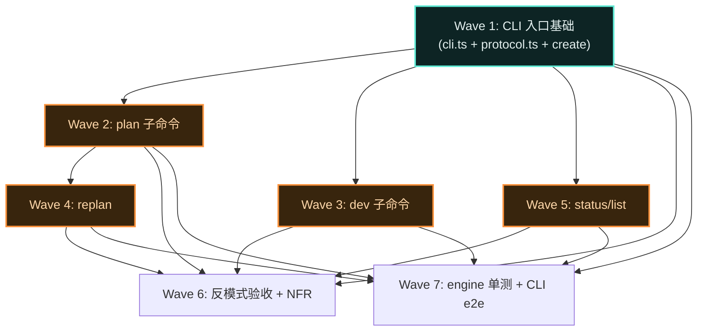

# 执行计划 — cw-cli-extract

## Wave 编排总览

### 依赖 DAG 图

### 调度表

| Wave | 切片 | P级 | Blocked by | 并行组 | 说明 |
|------|------|-----|-----------|--------|------|
| W1 | 垂直切片 | P0 | 无 | — | CLI 入口 + protocol + create 子命令 |
| W2 | 垂直切片 | P0 | W1 | G1 | plan 子命令 + stdin/文件 + plan-parser |
| W3 | 垂直切片 | P0 | W1 | G1 | dev 子命令 + GitValidator 接线 |
| W4 | 垂直切片 | P1 | W2 | — | replan 子命令 + append-only 校验 |
| W5 | 垂直切片 | P1 | W1 | G1 | status/list 子命令 |
| W6 | 验收 | — | W1-W5 | G2 | 反模式验收 + NFR 测试 |
| W7 | 验收 | — | W1-W5 | G2 | engine 单测迁移 + CLI e2e |

### 并行约束
- 同组最多 3 个 subagent 并行
- 同文件不允许多 Wave 同时修改
- W2/W3/W5 可并行（都只依赖 W1，且修改不同文件）
- W6/W7 可并行（验收类，互不冲突）

## Wave 详情

### Wave 1: CLI 入口基础

**切片类型**: 垂直切片
**P 级覆盖**: P0 (#1, #2, #3, #5, #6)
**Blocked by**: 无——可立即开始
**并行关系**: 首个 Wave

#### 包含的功能/issue
- 功能: UC-1 create（关联 §4.1 时序图）
- Issue: #1（engine 搬迁）、#2（CLI 两层结构）、#3（存储路径）、#5（StringEnum）、#6（信封下沉）

#### 文件影响
- 创建: `package.json`, `tsconfig.json`, `src/cli/cli.ts`, `src/cli/protocol.ts`
- 创建: `src/engine/types.ts`, `src/engine/state-machine.ts`, `src/engine/store.ts`, `src/engine/gates.ts`, `src/engine/plan-parser.ts`, `src/engine/dispatch.ts`（含所有 9 个 action handler 路由桩）, `src/engine/actions/create.ts`
- 测试: `tests/cli-e2e/skeleton.test.ts`

#### 覆盖的 test-matrix 用例 ID
- T1.1, T1.2, T1.3, T1.4, T1.5, T1.6, T1.7, T1.8（UC-1 全量）
- T7.1, T7.2, T7.3（NFR: typebox 参数校验）
- T7.4, T7.5（NFR: 路径穿越防护 + .cw-wt/ 检测）

#### Subagent 配置
| 配置项 | 值 |
|--------|---|
| Agent | general-purpose |
| 注入上下文 | code-architecture.md §4.1 时序图 + §3 签名表 + issues #1-6 |
| 读取文件 | code-skeleton/（已有骨架，直接在骨架上填充实现） |
| 修改/创建文件 | package.json, tsconfig.json, src/cli/*, src/engine/*, tests/cli-e2e/* |

#### 执行流
1. general-purpose → 在 code-skeleton 基础上填充 store.ts 方法体（JSON 读写 + 原子写 + 事务）
2. general-purpose → 填充 state-machine.ts 叶子逻辑（guard 判定 + gatePassed 计算）
3. general-purpose → 填充 cli.ts readStdin + 测试 create 子命令
4. general-purpose → 跑 `tsc --noEmit` 确认编译通过

#### 验收标准
- [ ] UC-1 AC-1.1~1.3 全过
- [ ] T7.1/T7.4 全过
- [ ] `tsc --noEmit` 无错
- [ ] `bash scripts/verify-anti-patterns.sh` 全绿

---

### Wave 2: plan 子命令

**切片类型**: 垂直切片
**P 级覆盖**: P0 (#2, #4, #7)
**Blocked by**: Wave 1
**并行关系**: 与 Wave 3/5 并行（G1 组）

#### 包含的功能/issue
- 功能: UC-2 plan（关联 §4.2 时序图）
- Issue: #2（stdin/文件读取）、#4（大 JSON 传递）、#7（exit code 分层）

#### 文件影响
- 修改: `src/engine/actions/plan.ts`（新建，实现 handlePlan：parseLitePlan → runGate → store.transaction(write) → buildNextAction）
- 修改: `src/engine/gates.ts`（填充 GATE_REGISTRY checkers + runGate 完整逻辑）
- 修改: `src/engine/plan-parser.ts`（填充 parseLitePlan 方法体：Value.Check + 字段映射）
- 测试: `tests/cli-e2e/skeleton.test.ts`（填充 T2.1~T2.6 断言体）

#### 覆盖的 test-matrix 用例 ID
- T2.1, T2.2, T2.3, T2.4, T2.5, T2.6（UC-2 全量）
- T7.6, T7.7, T7.8（NFR: 文件读取边界）
- T7.9, T7.10（NFR: exit code 分层契约）
- T7.11（NFR: stderr 错误输出）

#### 执行流
1. general-purpose → 实现 plan-parser.ts parseLitePlan（Value.Check + 字段映射）
2. general-purpose → 实现 gates.ts runGate + 填充 GATE_REGISTRY checkers
3. general-purpose → 实现 actions/plan.ts handlePlan
4. general-purpose → 跑 T2.1~T2.6 测试

#### 验收标准
- [ ] UC-2 AC-2.1~2.4 全过
- [ ] T7.6/T7.9/T7.11 全过
- [ ] stdin/文件读取 + 冲突检测工作正常

---

### Wave 3: dev 子命令

**切片类型**: 垂直切片
**P 级覆盖**: P0 (#7)
**Blocked by**: Wave 1
**并行关系**: 与 Wave 2/5 并行（G1 组）

#### 包含的功能/issue
- 功能: UC-3 dev（关联 §4.3 时序图）
- Issue: #7（exit code 分层）

#### 文件影响
- 修改: `src/engine/actions/dev.ts`（新建，实现 handleDev：per task GitValidator.validate → setWaveCommitted → computeNextStatus → buildNextAction）
- 测试: `tests/cli-e2e/skeleton.test.ts`（填充 T3.1~T3.5 断言体）

#### 覆盖的 test-matrix 用例 ID
- T3.1, T3.2, T3.3, T3.4, T3.5（UC-3 全量）

#### 执行流
1. general-purpose → 实现 gates.ts GitValidator.validate 完整逻辑（三项校验）
2. general-purpose → 实现 store.ts setWaveCommitted
3. general-purpose → 实现 actions/dev.ts handleDev
4. general-purpose → 跑 T3.1~T3.5 测试

#### 验收标准
- [ ] UC-3 AC-3.1~3.4 全过
- [ ] GitValidator 三项校验工作正常（cat-file + inRepo + diff-tree）

---

### Wave 4: replan 子命令

**切片类型**: 垂直切片
**P 级覆盖**: P1 (#1)
**Blocked by**: Wave 2（需要 plan 子命令先工作）
**并行关系**: 串行

#### 包含的功能/issue
- 功能: UC-6 replan（关联 §4.4 时序图）
- Issue: #1（engine 搬迁）

#### 文件影响
- 修改: `src/engine/actions/replan.ts`（新建，实现 handleReplan：append-only 校验 → appendWaves/appendTestCases → buildNextAction）
- 修改: `src/engine/store.ts`（填充 appendWaves + appendTestCases）
- 测试: `tests/cli-e2e/skeleton.test.ts`（填充 T6.1~T6.4 断言体）

#### 覆盖的 test-matrix 用例 ID
- T6.1, T6.2, T6.3, T6.4（UC-6 全量）

#### 执行流
1. general-purpose → 实现 store.ts appendWaves + appendTestCases（append-only 语义）
2. general-purpose → 实现 actions/replan.ts handleReplan（append-only 校验逻辑）
3. general-purpose → 跑 T6.1~T6.4 测试

#### 验收标准
- [ ] UC-6 AC-6.1~6.3 全过
- [ ] append-only 守卫生效（T6.2）

---

### Wave 5: status/list 子命令

**切片类型**: 垂直切片
**P 级覆盖**: P1 (#8)
**Blocked by**: Wave 1
**并行关系**: 与 Wave 2/3 并行（G1 组）

#### 包含的功能/issue
- 功能: UC-4 status/list（关联 §4.5 时序图）
- Issue: #8（CLI 只读查询）

#### 文件影响
- 修改: `src/cli/cli.ts`（填充 handleStatus + handleList）
- 修改: `src/engine/store.ts`（填充 listTopics）
- 测试: `tests/cli-e2e/skeleton.test.ts`（填充 T4.1~T4.4 断言体）

#### 覆盖的 test-matrix 用例 ID
- T4.1, T4.2, T4.3, T4.4（UC-4 全量）

#### 执行流
1. general-purpose → 实现 store.ts listTopics
2. general-purpose → 实现 cli.ts handleStatus + handleList
3. general-purpose → 跑 T4.1~T4.4 测试

#### 验收标准
- [ ] UC-4 AC-4.1~4.2 全过
- [ ] 空库 list 返回 []

---

### Wave 6: 反模式验收 + NFR 测试

**切片类型**: 验收
**P 级覆盖**: —
**Blocked by**: Wave 1-5（所有功能 Wave）
**并行关系**: 与 Wave 7 并行（G2 组）

#### 职责
- 跑 `bash scripts/verify-anti-patterns.sh` 确认 8 项全绿
- 补充 NFR 集成测试（T7.1~T7.11 完整断言体）
- 确认所有 NFR 用例 PASS

#### 覆盖的 test-matrix 用例 ID
- T7.1, T7.2, T7.3, T7.4, T7.5, T7.6, T7.7, T7.8, T7.9, T7.10, T7.11（NFR 全量）

#### 验收标准
- [ ] 反模式验收脚本 8 项全绿
- [ ] NFR 集成测试全 PASS

---

### Wave 7: engine 单测迁移 + CLI e2e

**切片类型**: 验收
**P 级覆盖**: —
**Blocked by**: Wave 1-5（所有功能 Wave）
**并行关系**: 与 Wave 6 并行（G2 组）

#### 职责
- 从 pi 扩展迁移 26 个 engine 单测到 `tests/engine/`
- 填充 CLI e2e 骨架测试断言体
- 跑全量测试确认全绿

#### 覆盖的 test-matrix 用例 ID
- T1.1~T1.8, T2.1~T2.6, T3.1~T3.5, T6.1~T6.4, T4.1~T4.4（功能用例全量）

#### 验收标准
- [ ] engine 26 个单测全绿
- [ ] CLI e2e 测试全绿
- [ ] 完整 lite 流程 e2e 通过（create → plan → dev → test → retrospect → closeout）

---

## 后续迭代（P3 延后项）

| Issue | 标题 | 延后理由 | 推进条件 |
|-------|------|----------|----------|
| #11 | MCP server 接口 | 用户明确范围收窄，单 CLI 先跑通 | 有实际 agent 需要 MCP 接入时 |
| #12 | 多 runtime adapter interface | 当前只有一个实现，抽象是单实现反模式 | 第二个 runtime 落地时 |
| #13 | 可配置 worktree-prefix 检测 | 当前仅 `.cw-wt/` 一种前缀 | 用户引入其他 worktree 命名时 |

## 测试验收清单（Test Acceptance Manifest）

| 用例 ID | 归属 UC | 来源 | 断言摘要 | 功能归属 Wave | 测试执行层 | dependsOn | parallelGroup | 状态 |
|---------|--------|------|---------|-------------|-----------|-----------|--------------|------|
| T1.1 | UC-1 | A 功能 | create lite topic → topicId + status=created + nextAction.plan | W1 | unit | — | — | 待验 |
| T1.2 | UC-1 | A 功能 | create mid topic → nextAction.clarify | W1 | unit | — | — | 待验 |
| T1.3 | UC-1 | A 功能 | slug 含特殊字符 → 成功 | W1 | unit | — | — | 待验 |
| T1.4 | UC-1 | A 功能 | 空 objective → 成功 | W1 | unit | — | — | 待验 |
| T1.5 | UC-1 | A 功能 | slug 重复 → PRIMARY KEY 冲突 | W1 | unit | — | — | 待验 |
| T1.6 | UC-1 | A 功能 | 无效 tier → typebox 校验失败 | W1 | unit | — | — | 待验 |
| T1.7 | UC-1 | A 功能 | topicId 重复 → throw | W1 | unit | — | — | 待验 |
| T1.8 | UC-1 | A 功能 | 完整 create 流程 e2e | W1 | e2e | T1.1 | — | 待验 |
| T2.1 | UC-2 | A 功能 | plan gate 通过 → status=planned | W2 | unit | T1.1 | — | 待验 |
| T2.2 | UC-2 | A 功能 | plan gate fail → status 不变 + gatePassed=false | W2 | unit | T1.1 | — | 待验 |
| T2.3 | UC-2 | A 功能 | format≠tier → 校验失败 | W2 | unit | T1.1 | — | 待验 |
| T2.4 | UC-2 | A 功能 | 非法状态转换 → GuardError | W2 | unit | T2.1 | — | 待验 |
| T2.5 | UC-2 | A 功能 | closed topic 调 plan → GuardError | W2 | unit | T2.1 | — | 待验 |
| T2.6 | UC-2 | A 功能 | stdin 传 plan.json e2e | W2 | e2e | T2.1 | — | 待验 |
| T3.1 | UC-3 | A 功能 | 单 wave commit → committed 更新 | W3 | unit | T2.1 | — | 待验 |
| T3.2 | UC-3 | A 功能 | 批量 wave commit | W3 | unit | T3.1 | — | 待验 |
| T3.3 | UC-3 | A 功能 | 无效 commitHash → valid=false | W3 | unit | T3.1 | — | 待验 |
| T3.4 | UC-3 | A 功能 | 全 committed 后 dev → 态内推进 | W3 | unit | T3.1 | — | 待验 |
| T3.5 | UC-3 | A 功能 | 完整 dev→test 流程 e2e | W3 | e2e | T3.1 | — | 待验 |
| T6.1 | UC-6 | A 功能 | replan 追加新 wave → 旧 committed 不变 | W4 | unit | T3.1 | — | 待验 |
| T6.2 | UC-6 | A 功能 | 修改已 committed wave → append-only 拒绝 | W4 | unit | T6.1 | — | 待验 |
| T6.3 | UC-6 | A 功能 | developed 状态 replan → 回退追加 | W4 | unit | T6.1 | — | 待验 |
| T6.4 | UC-6 | A 功能 | 连续两次 replan | W4 | unit | T6.1 | — | 待验 |
| T4.1 | UC-4 | A 功能 | 查询已存在 topic → JSON 含完整状态 | W5 | unit | T1.1 | — | 待验 |
| T4.2 | UC-4 | A 功能 | 查询不存在 topic → throw | W5 | unit | — | — | 待验 |
| T4.3 | UC-4 | A 功能 | list 所有 topic | W5 | unit | T1.1 | — | 待验 |
| T4.4 | UC-4 | A 功能 | 空库 list → [] | W5 | unit | — | — | 待验 |
| T7.1 | NFR | B NFR | 无效 CLI 参数 → exit ≠0 | W6 | integration | T1.1 | — | 待验 |
| T7.2 | NFR | B NFR | 缺必填字段 → exit ≠0 | W6 | integration | — | — | 待验 |
| T7.3 | NFR | B NFR | 非法 JSON → exit ≠0 | W6 | integration | T2.1 | — | 待验 |
| T7.4 | NFR | B NFR | 路径穿越 CW_HOME → throw | W6 | integration | — | — | 待验 |
| T7.5 | NFR | B NFR | .cw-wt/ 检测 → throw | W6 | integration | — | — | 待验 |
| T7.6 | NFR | B NFR | 文件不存在 → exit ≠0 | W6 | integration | T2.1 | — | 待验 |
| T7.7 | NFR | B NFR | 非 JSON 文件 → exit ≠0 | W6 | integration | T2.1 | — | 待验 |
| T7.8 | NFR | B NFR | 超大文件 → exit ≠0 | W6 | integration | T2.1 | — | 待验 |
| T7.9 | NFR | B NFR | gate fail → exit 0 | W6 | integration | T2.2 | — | 待验 |
| T7.10 | NFR | B NFR | illegal_transition → exit ≥1 | W6 | integration | T2.4 | — | 待验 |
| T7.11 | NFR | B NFR | stderr 人类可读 | W6 | integration | T2.4 | — | 待验 |

**闭环要求：**
- 清单用例 ID 集合 = code-architecture.md §6 来源 A + 来源 B 全量（39 条）
- W7 的 engine 单测覆盖 T1.1~T1.8（UC-1），CLI e2e 覆盖 T2.6/T3.5/T1.8（完整 lite 流程）
- 末尾验收 Wave（W6+W7）blocked_by 所有功能 Wave，全 PASS = 实现完成

## 执行交接

编码完成的定义 = 测试验收清单全绿。

- **W1-W5**：功能 Wave，每个 Wave 派 fresh subagent，在 code-skeleton 基础上填充实现
- **W6-W7**：验收 Wave，blocked_by W1-W5，全量回归
- **偏离通道**：编码中发现用例设计错误/不可行，走 `[DEVIATED]` 登记（附原因 + 用户确认）
