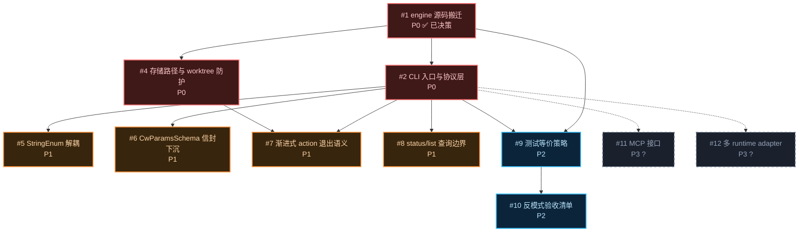

# Issue 决策图 — cw-cli-extract

> 来源：system-architecture.md §5/§7/§8/§10
> 下游：non-functional-design.md / code-architecture.md / execution-plan.md
> 模式：fog-of-war，从 mid-plan 已确认架构推导实施级 issue。

## 地图总览

## 上游覆盖核验（MANDATORY，逐条不漏）

| 上游元素 | 轴 | 对应 issue | 状态 | N/A 理由 |
|---------|----|-----------|------|----------|
| §5: 8 态状态机 TRANSITIONS 表 | 状态 | #1 | 已覆盖 | 源码搬迁即覆盖 |
| §5: replan 回退语义（planned/developed→planned） | 状态 | #1, #7 | 已覆盖 | #1 复现，#7 定义退出语义 |
| §5: Reason 字段正交维度 | 状态 | #1 | 已覆盖 | engine 已含，搬迁不变 |
| §5: 三重 guard（checkLinear/PhaseCascade/CacheConsistency） | 状态 | #1 | 已覆盖 | 源码搬迁 |
| §7: cli.ts 子命令路由 | 模块 | #2 | 已覆盖 | CLI 入口设计 |
| §7: protocol.ts 参数校验 | 模块 | #2, #6 | 已覆盖 | 校验层 + 信封下沉 |
| §7: dispatch + actions/* | 模块 | #1 | 已覆盖 | 源码搬迁 |
| §7: state-machine + checks + gates | 模块 | #1 | 已覆盖 | 源码搬迁 |
| §7: store + plan-parser + types | 模块 | #1 | 已覆盖 | 源码搬迁 |
| §7: resolveDbPath 改写 | 模块 | #4 | 已覆盖 | 存储路径参数化 |
| §8: 与 git 客户-供应商关系 | 边界 | #1 | 已覆盖 | GitValidator 复用 |
| §8: 与文件系统客户-供应商关系 | 边界 | #1 | 已覆盖 | CwStore 复用 |
| §8: 与调用方 agent JSON stdio 契约 | 边界 | #2 | 已覆盖 | CLI 协议定义 |
| §8: 与 pi 扩展解耦 | 边界 | #1, #5 | 已覆盖 | pi 依赖移除 |
| §10 D-A: RuntimeAdapter 不抽象 | 挑战 | #8, #12 | 已覆盖 | #8 界定 scope，#12 P3 延后 |
| §10 D-C/D: 大 JSON 传递机制 | 挑战 | #2 | 已覆盖 | stdin/file 双通道 |
| §10 D-E: nextAction.skill 透传 | 挑战 | #2 | 已覆盖 | 协议层不处理 skill |
| §10 D-F: ADR-029 worktree 防护 | 挑战 | #4 | 已覆盖 | worktree 检测 |
| §11: StringEnum 替换 | 反模式 | #5 | 已覆盖 | typebox native 替换 |
| §11: exit code 分层契约 | 反模式 | #7 | 已覆盖 | 渐进式退出语义 |
| §11: CwParamsSchema 信封下沉 | 反模式 | #6 | 已覆盖 | 信封下沉到 protocol.ts |

## P0 Issues（阻塞项，必须先做）

### #1: 如何复用 engine 源码而不引入 pi 运行时依赖

**P 级**: P0
**类型**: 架构 / 模块
**Blocked by**: 无
**推荐强度**: Strong

#### 问题描述
pi 扩展 `src/index.ts` 是 engine 与 pi 的注册薄壳，但 engine 核心（state-machine/actions/checks/store/gates/plan-parser）已确认零 pi 依赖。本 issue 决定如何将 engine 源码从 pi 扩展仓库搬迁到独立 npm 包，同时保证零 pi 运行时 import、行为等价、26 个单测可原样运行。

#### 为什么是这个 P 级
不做则 engine 无法脱离 pi，G1「engine 独立运行」直接失败；没有 engine 源码，后续 CLI 适配层、存储路径替换、测试等价都无从谈起。

#### 方案对比

**方案 A: 物理拷贝（file copy）**
- 架构：将 pi 扩展的 `src/cw/**/*` 完整拷贝到 `@zhushanwen/coding-workflow` 包的 `src/engine/` 下，保留原文件路径。
- 模块：新增 `src/engine/` 目录；删除原 pi 扩展中对 engine 文件的 import，改为 depend on npm 包。
- 模型：不变（CwTopic/Wave/TestCase/ActionResult 原样）。
- 流程：新包初始化 → 拷贝 → 在新包运行 engine 单测 → 确认全绿。
- 优点：最忠实，行为等价天然最强；26 个测试文件路径不变，迁移成本最低。
- 缺点：pi 扩展与新包之间会有短暂代码双写（直到 pi 扩展改为 depend on 新包）。
- 适用场景：本轮 refactor 首选，符合 G3 100% 等价。

**方案 B: git subtree / git submodule**
- 架构：用 git subtree 把 engine 历史保留为新包子目录，或 submodule 共享。
- 模块：engine 历史独立可追踪。
- 优点：保留 blame 历史；未来 bug 修复可双向同步。
- 缺点：引入 git 子树复杂度；本仓库是 `.bare` + worktree 结构，subtree 操作与现有工作流冲突；双向同步容易出错。
- 适用场景：长期维护多仓库共享 engine，但本轮只需要「一次性搬迁 + pi 扩展 depend on 新包」，过度。

**方案 C: 重写 engine（不推荐）**
- 架构：不拷贝，按架构文档重新实现。
- 缺点：违背 G3 等价性；引入回归风险；26 个测试需重写。
- 适用场景：无。

#### 取舍决策
**选择**: 方案 A（物理拷贝）
**理由**: 长期方案（architecture 正确归位：engine 作为独立包的核心资产；不引入技术债；未来 pi 扩展 depend on 新包即可）。subtree 的双向同步是短期方案里的 workaround，会留下复杂维护路径。

**放弃方案的理由**:
- 方案 B: 短期看保留历史有价值，但 `.bare` worktree 结构下 subtree 操作容易与 workspace 管理冲突；且本轮只需单向搬迁，双向同步能力用不上，成为技术债。
- 方案 C: 与 G3 直接冲突，不讨论。

---

### #2: 如何构造 CLI 适配层入口（子命令 + 协议校验 + 输出序列化）

**P 级**: P0
**类型**: 模块 / 流程
**Blocked by**: #1
**推荐强度**: Strong

#### 问题描述
用独立 CLI 进程替换 pi 的 `pi.registerTool()` 调用。需要定义：
- action 到子命令的映射（`cw create`, `cw plan`, `cw dev`, `cw test`, `cw replan` 等）
- 大 JSON 参数传递方式（stdin 主通道 + `--xxx-file` 显式文件）
- 参数校验（复用 typebox，从 plan-parser 引 schema）
- 输出序列化（stdout JSON + exit code）
- 错误处理（stderr 人类可读）

#### 为什么是这个 P 级
不做则任意 agent 无法驱动 engine，G2「可被任意 agent 子进程驱动」失败；它是 engine 与外部世界唯一的接口。

#### 方案对比

**方案 A: 两层结构（cli.ts + protocol.ts）**
- cli.ts：负责 argv 解析、子命令路由、构造 ActionDeps、调用 dispatch、序列化输出、exit code 映射。
- protocol.ts：负责 CwParams 信封 schema、typebox 校验、stdin/文件读取、参数合并逻辑。
- 优点：职责清晰；protocol.ts 可独立测试；未来 MCP 只需替换 cli.ts 层，protocol.ts 复用。
- 缺点：多一个文件，但 LOC 可控（~80）。
- 适用场景：本轮推荐，符合 D-A「不抽象 port 但保持层边界清晰」。

**方案 B: 单层结构（cli.ts 包揽一切）**
- 所有逻辑集中在 cli.ts。
- 优点：文件少，乍一看简单。
- 缺点：协议校验与 CLI 路由耦合；未来 MCP 接入时难以复用；单文件过大，测试粒度粗。
- 适用场景：一次性脚本，不适合长期演进。

**方案 C: 用 commander/yargs 等框架**
- 引入第三方 CLI 框架解析 argv。
- 优点：子命令 help、错误提示自动生成。
- 缺点：新增外部依赖；action 映射与 typebox 校验需要桥接；框架 help 输出与人类化错误与 G2 的「stdout JSON 协议」可能冲突。
- 适用场景：若子命令复杂（10+ 子命令、大量 flag），框架有价值。本轮 9 个 action，且输出必须是纯 JSON，框架 help 非必需，不引入。

#### 取舍决策
**选择**: 方案 A（两层结构）
**理由**: 长期方案（层边界正确；protocol.ts 是 MCP 落地的复用点；cli.ts 只负责 argv 与进程语义）。单层是短期方案，会引入耦合技术债。CLI 框架本轮过度。

**放弃方案的理由**:
- 方案 B: 单层导致路由/校验/序列化耦合，未来扩展 MCP 时大概率要拆分，届时是推翻重写而非复用。
- 方案 C: 框架引入的 help 与 JSON-only stdout 冲突，且外部依赖与 G1 的「最小依赖」精神相悖。

---

### #3: 如何替换 pi 专用存储路径与 worktree 约定

**P 级**: P0
**类型**: 架构 / 边界
**Blocked by**: #1
**推荐强度**: Strong

#### 问题描述
pi 扩展的 `resolveCwDbPath` 硬编码 `~/.pi/agent/cw/`，且 `execute()` 依赖 ADR-029 worktree 命名约定（`.cw-wt/` 检测）防止数据隔离错误。本 issue 决定：
- 新包数据根目录放在哪里（`~/.cw/`）
- 是否保留 per-cwd 的 `<encoded-cwd>` 子目录结构
- 是否保留 `.cw-wt/` worktree 检测
- 如何让用户覆盖路径（env / flag）

#### 为什么是这个 P 级
硬编码 pi 路径是 G1 的核心阻碍；数据隔离错误会导致多 worktree 用户丢失/串 topic。不做则无法正确持久化。

#### 方案对比

**方案 A: 完整路径结构 + 双覆盖（`~/.cw/<encoded-cwd>/_cw.json`，`CW_HOME` + `--workspace`）**
- 保留 per-cwd 隔离：`<encoded-cwd>` 子目录结构原样复用 `path-encoding.ts`。
- 覆盖方式：根目录用 `CW_HOME` env；workspacePath 用 `--workspace` flag 或 `CW_WORKSPACE_ROOT` env。
- worktree 防护：保留 `.cw-wt/` 检测，拒绝 process.cwd() fallback。
- 优点：multi-workspace 正确性；与 pi 行为等价（D-002 已确认）。
- 缺点：路径较长，需要用户理解 encoded-cwd 规则。

**方案 B: 扁平化单一文件（`~/.cw/_cw.json`）**
- 所有 workspace 共用一个 _cw.json。
- 优点：简单。
- 缺点：multi-workspace 冲突；两个项目同 topicId 会覆盖；违反 D-002 的 per-cwd 隔离。
- 适用场景：无。

**方案 C: 可配置 worktree-prefix（泛化）**
- 把 `.cw-wt/` 检测改为可配置前缀列表。
- 优点：更通用，适配不同 worktree 命名。
- 缺点：增加配置复杂度；本轮没有多前缀需求，过度设计。
- 适用场景：后续 topic。

#### 取舍决策
**选择**: 方案 A（完整路径结构 + 双覆盖）
**理由**: 长期方案（数据隔离正确归位；覆盖机制清晰；worktree 防护保留）。扁平化是错误方案，泛化前缀是过度设计。

**放弃方案的理由**:
- 方案 B: 直接破坏 multi-workspace 正确性，是架构错误。
- 方案 C: 当前需求只有一个 `.cw-wt/` 前缀，泛化会引入无根据的抽象；MCP/多 runtime 留后续 topic 时再评估。

---

### #4: 大 JSON 参数传递机制（stdin vs 文件）

**P 级**: P0
**类型**: 流程 / 协议
**Blocked by**: #2
**推荐强度**: Strong

#### 问题描述
`plan.json` / `clarify.json` / `detail.json` / `tasks` / `cases` 等数据量大，不能直接作为命令行 flag。需要决定：
- 主通道：stdin pipe
- 显式通道：`--xxx-json-file` 或 `--xxx-file`
- 两者同时存在时的优先级/冲突处理
- 空 stdin 或非法 JSON 的错误处理

#### 为什么是这个 P 级
D-001 已确认大 JSON 走 stdin/--xxx-file，但具体实现策略（冲突、默认值、错误消息）未定。如果冲突处理不清晰，调用方 agent 会写错。

#### 方案对比

**方案 A: stdin 优先，文件为 fallback，两者同时存在 = 冲突错误**
- 默认读 stdin；若 stdin 是 TTY 或空，则查找 `--xxx-file`；两者都提供则报错。
- 优点：符合 Unix 管道习惯；避免歧义。
- 缺点：需要检测 stdin 是否来自 pipe，在 Windows 上略有差异（Node.js 已抽象）。
- 适用场景：D-001 已确认，此方案最自然。

**方案 B: 文件优先，stdin 仅作为可选**
- 默认查找 `--xxx-file`；未提供再从 stdin 读。
- 优点：agent 显式指定文件，调试方便。
- 缺点：与 D-001 的「stdin 主通道」精神相悖；增加文件系统 IO 路径。
- 适用场景：不推荐。

**方案 C: 同时接受两者，合并（JSON deep merge）**
- stdin 和文件同时提供时 deep merge。
- 优点：灵活。
- 缺点：合并语义复杂，容易隐藏 bug；调用方不知何时用哪个。
- 适用场景：无。

#### 取舍决策
**选择**: 方案 A（stdin 优先，文件 fallback，同时存在冲突）
**理由**: 与 D-001 完全一致；无歧义；Unix 语义自然。调用方 agent 写 pipe 调用时只需 stdin；人类调试时可显式 `--xxx-file`。

**放弃方案的理由**:
- 方案 B: 与已确认 D-001 冲突。
- 方案 C: 合并语义引入隐式规则，是短期 hack 类方案；长期维护困难。

---

## P1 Issues（核心项）

### #5: 如何替换 `@earendil-works/pi-ai` 的 StringEnum

**P 级**: P1
**类型**: 模块 / 边界
**Blocked by**: #1, #2
**推荐强度**: Strong

#### 问题描述
pi 扩展的 `CwParamsSchema` 用 `StringEnum`（`@earendil-works/pi-ai`）定义 `action` 和 `tier` 枚举。G1 要求运行时零 pi 依赖。本 issue 决定替换方案。

#### 方案对比

**方案 A: typebox-native `Type.Union([Type.Literal(...)])`**
- 用纯 `@sinclair/typebox` 的 `Type.Union` 替换 `StringEnum`。
- 优点：无 pi 依赖；typebox 是已允许的公共依赖；与现有 plan-parser 风格一致。
- 缺点：schema 定义稍长（每个枚举值一个 `Type.Literal`）。

**方案 B: TypeScript 字面量类型 + 运行时手动校验**
- 定义 `type CwAction = 'create' | 'plan' | ...`；运行时手写 switch 校验。
- 优点：无 schema 依赖。
- 缺点：类型与校验分离，容易 drift；typebox 已是项目依赖，没必要手动校验。
- 适用场景：无。

#### 取舍决策
**选择**: 方案 A（typebox Type.Union）
**理由**: 长期方案（类型与校验统一在 typebox schema；与 plan-parser 风格一致）。

**放弃方案的理由**:
- 方案 B: 手动校验与类型分离，是经典技术债。

---

### #6: CwParamsSchema 信封如何下沉到 protocol.ts

**P 级**: P1
**类型**: 模块
**Blocked by**: #2
**推荐强度**: Strong

#### 问题描述
业务 schema（LitePlanSchema/MidClarifySchema/MidDetailSchema/TestCaseSubmissionSchema）已在 plan-parser.ts 单源声明。但 CwParams 信封（包含 action、topicId、slug、tier、objective、各 JSON payload 字段等）原定义在 pi 扩展的 `src/index.ts`，随 pi 适配层替换失去落脚点。本 issue 决定信封 schema 定义位置。

#### 方案对比

**方案 A: 信封定义在 `protocol.ts`，业务 schema import 自 `plan-parser.ts`**
- `protocol.ts` 定义 `CwParamsSchema`（信封），对 payload 字段用 `Type.Optional(LitePlanSchema)` 等引用。
- 优点：信封与校验层同处；CLI 和 MCP 未来都 import protocol.ts；业务 schema 仍单源。
- 缺点：需要额外一个文件；但这是设计意图。

**方案 B: 信封与业务 schema 合并到 `plan-parser.ts`（单源过度）**
- 把 `CwParamsSchema` 也放进 plan-parser.ts。
- 优点：所有 schema 一个文件。
- 缺点：plan-parser.ts 被 engine 和 CLI 同时 import，CwParams 是 CLI 协议信封，不属于 engine 领域；合并会污染 engine 的 schema 层。
- 适用场景：无。

#### 取舍决策
**选择**: 方案 A（信封在 protocol.ts，业务 schema import 自 plan-parser）
**理由**: 长期方案（信封属于 CLI 协议层，与 engine 领域 schema 分离；未来 MCP 复用 protocol.ts 而不污染 engine）。

**放弃方案的理由**:
- 方案 B: 把协议信封下沉到 engine 层，破坏分层纪律，是短期省事的方案。

---

### #7: 渐进式 action（dev/test/retrospect）的退出语义与状态回滚

**P 级**: P1
**类型**: 状态 / 流程
**Blocked by**: #2, #3
**推荐强度**: Strong

#### 问题描述
requirements AC-2.4 定义 exit code 分层契约：exit 0 = 程序正常（gate pass/fail 都是正常返回，结果在 stdout JSON）；exit ≥1 = 程序错误。但 dev/test 是渐进式 action（progressive=true），提交单个 wave 或 testCase 失败后 status 不变，此时 exit 应为 0。本 issue 决定：
- gate fail 时 exit 0（正常返回）+ JSON.gatePassed=false
- 非法状态转换 exit ≥1（程序错误）
- 渐进式提交部分失败时 nextAction 如何反映进度

#### 方案对比

**方案 A: 严格分层（exit 0 = 程序正常，exit ≥1 = 程序错误）**
- 所有 gate fail 都是 exit 0；只有非法转换、参数错误、内部异常才 exit ≥1。
- 优点：调用方 agent 可靠：exit 0 意味着「可以 parse stdout JSON」，exit ≥1 意味着「需要看 stderr 并可能重试/修复调用」。
- 缺点：agent 需要读 JSON 判 gate 结果，不能仅凭 exit code。
- 适用场景：推荐，符合 requirements C-1。

**方案 B: exit code 反映 gate 结果（gate fail = 非零）**
- 简单但破坏 D-001/AC-2.4 的协议分层。
- 缺点：调用方无法区分「gate fail（应重试或改 mustFix）」和「illegal_transition（调用 bug）」。
- 适用场景：无，与已确认 C-1 冲突。

#### 取舍决策
**选择**: 方案 A（严格分层）
**理由**: 长期方案（协议语义清晰，调用方可预期）。

**放弃方案的理由**:
- 方案 B: 与 C-1 已确认约束冲突，且是短期直觉型方案。

---

### #8: status/list 查询命令是否属于 engine 边界

**P 级**: P1
**类型**: 边界
**Blocked by**: #2
**推荐强度**: Worth exploring

#### 问题描述
requirements UC-4 定义 `cw status` / `cw list` 为 CLI 新增便利命令，非 engine action。dispatch 9 个 CwAction 无 status/list。需要决定：
- status/list 是否直接读 _cw.json 并序列化
- 是否允许 `--json` 输出
- 人读摘要是否复用/改写 `renderSummary`（pi TUI 专属文本）

#### 方案对比

**方案 A: CLI 层只读查询（直接 loadTopic + JSON 序列化）**
- status/list 不经过 dispatch，直接调用 `CwStore.loadTopic` 或 `CwStore.listTopics`。
- 优点：不污染 engine 状态机；实现简单。
- 缺点：绕过 dispatch 的契约一致性；但 status/list 是纯查询，不触发状态变更，合理。

**方案 B: 把 status/list 加入 CwAction 枚举**
- 扩展 engine 支持 `status` / `list` action。
- 优点：统一接口。
- 缺点：engine 行为变更（G3 等价性要求 engine 行为与 pi 一致，pi 无此 action）；增加非必要复杂度。
- 适用场景：无。

#### 取舍决策
**选择**: 方案 A（CLI 层只读查询）
**理由**: 与 requirements UC-4 标注一致；不破坏 engine 边界；非 G3 等价范围。

**放弃方案的理由**:
- 方案 B: 会改变 engine 的 action 集合，违反 G3 的「100% 等价」约束。

---

## P2 Issues（重要项）

### #9: 测试等价策略（迁移 vs 重写）

**P 级**: P2
**类型**: 流程
**Blocked by**: #1, #2
**推荐强度**: Worth exploring

#### 问题描述
D-004 已确认：保留 engine 26 个单测原样 + 新增 CLI e2e 覆盖完整 lite 流程。本 issue 决定具体迁移策略：单测目录结构、测试运行器、CLI e2e 的实现方式。

#### 方案对比

**方案 A: 单测原样拷贝 + 新增 `tests/cli-e2e/` 目录**
- engine 测试在 `src/engine/__tests__/` 原样运行；CLI e2e 在 `tests/cli-e2e/` 用 `execa`/`child_process` 调 `cw`。
- 优点：engine 单测与 pi 扩展一致；CLI e2e 独立清晰。
- 缺点：需要两套测试配置（vitest + e2e runner）。
- 适用场景：推荐。

**方案 B: 把单测迁移到 CLI 入口上重跑**
- 用 CLI 子进程调用替换单测里的 dispatch 直接调用。
- 优点：所有测试都经过 CLI 入口。
- 缺点：工作量大；定位 bug 时难区分 engine 还是 CLI 问题；违反 D-004 的「单测原样」约束。
- 适用场景：无。

#### 取舍决策
**选择**: 方案 A（单测原样 + 新增 e2e 目录）
**理由**: 与 D-004 完全一致；单测证 engine 等价，e2e 证 CLI 协议。

---

### #10: 反模式验收清单如何自动化

**P 级**: P2
**类型**: 流程
**Blocked by**: #9
**推荐强度**: Speculative

#### 问题描述
system-architecture §11 列出 8 条反模式验收项（无 pi 依赖、无 copy-paste、无单实现 interface、store/gates 零改动、StringEnum 替换、exit code 契约、worktree 防护、CwParamsSchema 信封下沉）。本 issue 决定如何验收（grep 脚本 / 测试断言 / 人工检查）。

#### 方案对比

**方案 A: 自动化 grep 脚本 + CI 校验**
- 写 `scripts/verify-anti-patterns.sh`（或 package.json 的 `verify` 脚本），运行时 grep import、检查 schema 位置、检查 exit code 映射等。
- 优点：可重复、可 CI 集成。
- 缺点：需要维护脚本。
- 适用场景：推荐，长期可维护。

**方案 B: 文档化清单 + 人工 review**
- 只在架构文档列出，release 前人工检查。
- 优点：无脚本成本。
- 缺点：容易遗漏；回归时无法保证。
- 适用场景：短期，不推荐。

#### 取舍决策
**选择**: 方案 A（自动化 grep 脚本）
**理由**: 长期方案（防回归，CI 可守）。

---

## 迷雾（未展开）

### #11: MCP server 接口

**状态**: 迷雾
**类型**: 边界
**说明**: 用户已确认 MCP 形态留后续 topic。本 issue 暂不展开，仅在 architecture 中保持 D-A 不抽象 port 的决策空间。

### #12: 多 runtime adapter interface

**状态**: 迷雾
**类型**: 架构
**说明**: 用户已确认多 runtime 留后续。当前 CLI 单形态，不抽象 RuntimeAdapter interface。MCP 落地时从迷雾推进为 investigating。

## 后续迭代（P3 延后项）

| # | 标题 | 延后理由 | 推进条件 |
|---|------|----------|----------|
| #11 | MCP server 接口 | 用户明确范围收窄，单 CLI 先跑通 | 有实际 agent 需要 MCP 接入时 |
| #12 | 多 runtime adapter interface | 当前只有一个实现，抽象是单实现 interface 反模式 | 第二个 runtime（MCP/VS Code 插件）落地时 |
| #13 | 可配置 worktree-prefix 检测 | 当前仅 `.cw-wt/` 一种前缀，无需配置 | 用户工作流引入其他 worktree 命名时 |
