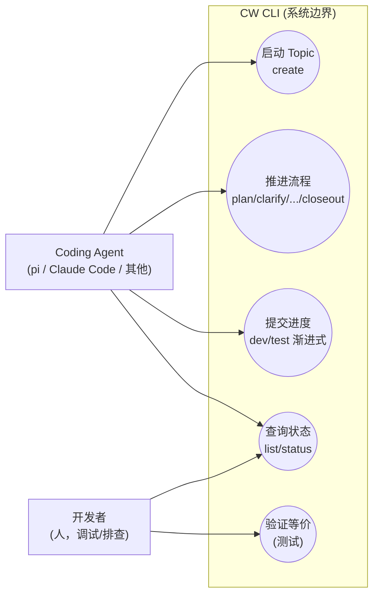
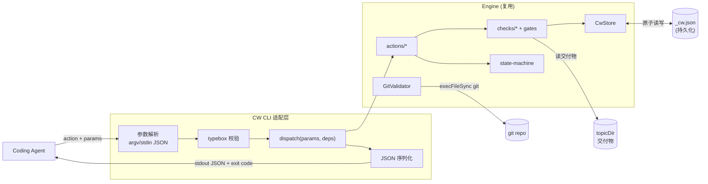
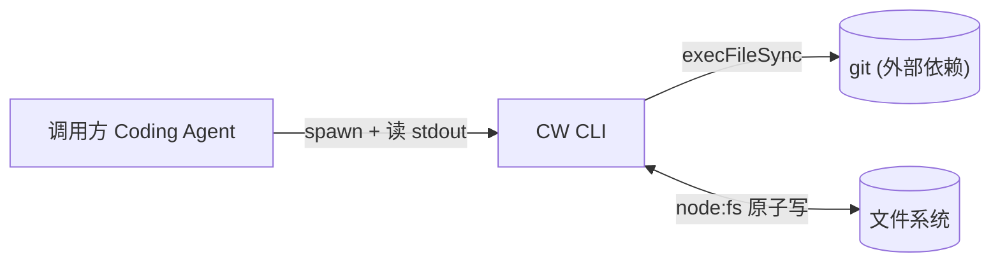

# coding-workflow engine 外置化为通用 CLI

> 来源：pi 扩展 `@zhushanwen/pi-coding-workflow`（`~/Code/xyz-pi-extensions-workspace/main/extensions/coding-workflow`）。本轮将核心 engine 抽离为 agent-agnostic 独立 CLI，MCP/多 runtime 形态留后续 topic。

## 1. 业务目标（Business Goals）

### 目标树
- **G1: engine 脱离 pi 独立运行** — 成功标准：不引入 `@mariozechner/pi-coding-agent` / `@earendil-works/pi-ai` 任何运行时依赖，engine 全部 action 可经 CLI 触发并返回正确 ActionResult
  - G1.1: 核心逻辑层（state-machine / actions / checks / store / gates / plan-parser）源码原样复用，零行为变更
  - G1.2: pi 耦合点（src/index.ts 的 registerTool 薄壳 + 存储路径字符串）被 CLI 适配层替换
- **G2: 可被任意 coding agent 经子进程驱动** — 成功标准：一个 coding agent 仅靠「spawn 子进程 + 读 stdout JSON」即可走完一条完整 CW 流程（create→...→closeout）
  - G2.1: CLI 提供稳定的 action→命令映射 + 参数传递机制 + 结构化 JSON 输出
  - G2.2: 现有 pi 扩展的测试套件能在 CLI 入口上等价跑通（行为不回归）
- **G3: engine 行为与现有 pi 扩展 100% 等价** — 成功标准：同一组 action 调用序列，CLI 与 pi 扩展产生相同的状态流转 / gate 结果 / 持久化数据

### 达成路线
| 目标 | 路线/策略 | 对应用例 |
|------|---------|---------|
| G1 | 抽离 engine 到独立包 + 新建 CLI 适配层替换 registerTool 薄壳 | UC-1, UC-2 |
| G2 | 设计 action→子命令映射 + JSON stdio 协议 + 参数校验复用 typebox | UC-3, UC-4 |
| G3 | 迁移现有测试套件到 CLI 入口，断言行为等价 | UC-5 |

## 2. 业务用例（Use Cases）

### 用例图

### UC-1: 启动 Topic
- **Actor**: Coding Agent
- **前置条件**: agent 有可写的 workspacePath
- **主流程**: 1. agent 调 `cw create --slug X --tier mid --objective "..."` 2. CLI 构造 ActionDeps（store/git/runner）3. 调 dispatch(handleCreate) 4. 输出含 topicId + nextAction 的 JSON 5. agent 解析 topicId 留作后续
- **替代流程**: workspacePath 用 `--workspace` 指定或 env 默认 process.cwd()；含 \`.cw-wt/\` 的 worktree cwd 拒绝 fallback（见 §7 约束 C-3）
- **异常流程**: slug 重复 → store 抛 PRIMARY KEY 冲突 → CLI 输出错误 JSON + 非零 exit code
- **后置状态**: _cw.json 新增 topic 记录（status=created）；topicDir 目录就绪
- **关联目标**: G1
- **验收标准 (AC)**:
  - AC-1.1 [正常]: `cw create` 返回 JSON 含 `topicId` 形如 `cw-YYYY-MM-DD-<slug>`（slug 为 create 时传入的 kebab-case 标识）、`status: "created"`、`nextAction.action` 为 plan 或 clarify（依 tier）
  - AC-1.2 [异常]: slug 重复时 exit ≠ 0，stderr 含冲突信息，不产生半成品 topic
  - AC-1.3 [边界]: tier=lite 时 nextAction 指向 plan；tier=mid 时指向 clarify

### UC-2: 推进流程（single-shot action）
- **Actor**: Coding Agent
- **前置条件**: topic 已存在且当前 status ∈ 该 action 的 expectedStatuses
- **主流程**: 1. agent 产出阶段交付物（plan.json/requirements.md 等）到 topicDir 2. 调 `cw plan --topicId X --plan-json '<json>'`（或 stdin/文件） 3. CLI 校验 JSON（typebox） 4. 调 dispatch 5. gate 跑机器检查 6. 输出 JSON（gatePassed + nextAction + 可选 mustFix），**exit code 始终 0**（gate 结果在 JSON.gatePassed 字段）
- **替代流程**: gate fail → status 不流转，nextAction 仍指向本 action + mustFix 列表，exit 仍 0（程序正常返回的结果）
- **异常流程**: 非法状态转换 → illegal_transition，exit ≠ 0 + stderr（程序错误，非 gate 结果）
- **后置状态**: gate 通过则 status 流转；gateHistory 追加记录；_cw.json 更新
- **关联目标**: G1, G3
- **验收标准 (AC)**:
  - AC-2.1 [正常]: gate 通过时 status 正确流转，nextAction 指向下一阶段
  - AC-2.2 [异常]: gate fail 时 status 不变，mustFix 列出具体 fail 项，**exit 仍 0**（gate 结果在 JSON.gatePassed=false，调用方读 JSON 判定重试）
  - AC-2.3 [边界]: format 字段 ≠ tier 锁定值时被拒（D-003 tier 锁定等价），exit ≠ 0
  - AC-2.4 [协议]: **exit code 分层契约**: exit 0 = 程序正常（gate pass/fail 都正常返回，结果在 stdout JSON）；exit ≥1 = 程序错误（参数校验失败/illegal_transition/topic not found/内部异常，stderr 人类可读）

### UC-3: 提交进度（dev/test 渐进式）
- **Actor**: Coding Agent
- **前置条件**: 处于 developed/tested 进行态
- **主流程**: 1. agent 完成 wave 的 commit 2. 调 `cw dev --topicId X --tasks '[{waveId,commitHash}]'` 3. CLI 调 dispatch 4. store 更新 wave.committed 5. 输出 JSON 含 waveProgress + nextAction
- **替代流程**: 多个 task 一次批量提交
- **异常流程**: commitHash 无法被 GitValidator 追溯 → gate fail
- **后置状态**: wave.committed 写入；达全 committed 则 gatePassed.dev=true
- **关联目标**: G2
- **验收标准 (AC)**:
  - AC-3.1 [正常]: dev 提交后 nextAction.waves 反映已 committed 进度
  - AC-3.2 [异常-mid test]: mid test 无效 commitHash（不可追溯已 committed 的 dev commit）→ 该 testCase 不标记 passed，gate fail
  - AC-3.3 [正常-lite test]: lite test 用 judgeByExpected 机器重算（exact-match），丢弃 claimedStatus；requiresScreenshot=true 且缺 screenshotPath → failed
  - AC-3.4 [正常-mid test]: mid test 信 claimedStatus + GitValidator 校验 commitHash 可追溯
- **注**: test 的 lite/mid 是 engine 里分歧最大的 gate（strong-recompute vs medium-coverage），见 architecture §5

### UC-4: 查询状态（CLI 新增便利命令，非 engine action）
- **Actor**: Coding Agent / 开发者
- **前置条件**: （status）topic 存在；（list）workspacePath 对应的 encoded-cwd 子目录下存在 _cw.json（见 D-002 路径）
- **主流程**: 调 `cw status --topicId X` 或 `cw list` → 输出 topic 当前 status/gatePassed/waves 进度
- **替代流程**: --json flag 控制 stdout JSON（agent 用）vs 人读摘要（开发者用）
- **关联目标**: G2
- **注**: dispatch 9 个 CwAction 无 status/list——CLI 层新增只读查询能力，非 G3 等价范围。nextAction 由 (tier,status) 反推，实现期定
- **验收标准 (AC)**:
  - AC-4.1 [正常]: status 输出 topic 的 status/gatePassed/waves/testCases 进度，与 engine loadTopic 一致
  - AC-4.2 [边界]: 不存在的 topicId → exit ≠ 0 + stderr 明确错误

### UC-5: 验证行为等价
- **Actor**: 开发者（CI / 手动）
- **前置条件**: 现有 pi 扩展测试套件可迁移
- **主流程**: 1. 取现有 `src/cw/__tests__` + `src/cw/actions/__tests__` + `src/cw/checks/__tests__` 2. 在 CLI 入口上重跑等价断言（或保留 engine 单元测试原样 + 新增 CLI e2e） 3. 断言状态流转/gate 结果/持久化数据与 pi 扩展一致
- **关联目标**: G3
- **验收标准 (AC)**:
  - AC-5.1 [正常]: engine 单元测试在抽离后全绿（核心逻辑零改动应天然满足）
  - AC-5.2 [正常]: CLI e2e 至少覆盖一条完整 lite 流程（create→plan→dev→test→retrospect→closeout）
  - AC-5.3 [正常-replan]: CLI e2e 补 replan 路径（plan 后 cw replan 追加 wave，断言 append-only 守卫生效），覆盖 9 个 action 中唯一回退语义
  - AC-5.4 [已知风险-mid]: mid 的 clarify.json/detail.json 经 CLI 入口无 e2e（D-004 scoping 后果）。风险登记：CLI adapter 对 mid JSON 解析 bug，engine 单测抓不到。缓解：detail 阶段补轻量 mid smoke 测试

### UC-6: 追加计划（replan，append-only）
- **Actor**: Coding Agent
- **前置条件**: status ∈ {planned, developed}（TRANSITIONS.replan expectedStatuses）
- **主流程**: 1. agent 产出追加的 plan.json（含新 wave/testCase） 2. 调 `cw replan --topicId X --plan-json '<json>'` 3. CLI 调 dispatch(handleReplan) 4. engine 校验 append-only（已 committed 的 wave 不可删改） 5. 追加新 wave/testCase 6. 输出 JSON 含 replanSummary + nextAction，exit 0
- **替代流程**: 仅追加未 committed 的 wave 或新 testCase（不改已 committed 的）
- **异常流程**: 破坏性变更（删/改已 committed wave）→ append-only 守卫拒绝，exit ≠ 0；status 非 planned/developed → illegal_transition，exit ≠ 0
- **后置状态**: status=planned（progressive）；waves/testCases 追加新条目；已 committed 的 wave 不变
- **关联目标**: G1, G3
- **验收标准 (AC)**:
  - AC-6.1 [正常]: replan 追加新 wave/testCase 后，nextAction.waves 含新条目 + 旧 committed 条目不变
  - AC-6.2 [异常]: 破坏性变更（修改已 committed wave）→ 被拒，exit ≠ 0 + stderr 明确 append-only 语义
  - AC-6.3 [边界]: status=developed 时 replan 仍可（回退到 planned 追加），已 committed wave 跨 replan 不变
- **注**: replan 是 9 个 action 中唯一既非 single-shot 又非 dev/test 的 action，v1 仅 lite tier

## 3. 数据流转（Data Flow）

### 数据流图

### 数据清单
| 数据 | 来源 | 处理 | 消费者 | 归档策略 | 敏感级别 |
|------|------|------|--------|---------|---------|
| action + 参数 | agent 调用 | CLI 解析+校验 | dispatch | 不持久化 | 无 |
| _cw.json | CwStore 写 | 原子写（temp+fsync+rename） | engine 各层 | 随 topic 生命周期 | 低（本地状态） |
| topicDir 交付物 | agent/skill 产出 | engine 读盘 gate 检查 | checks/* | 随项目目录 | 无 |
| ActionResult | dispatch 返回 | CLI 序列化 | agent | 不持久化 | 无 |

## 4. 功能清单（Features）

| 编号 | 功能 | 对应用例 | 关联目标 |
|------|------|---------|---------|
| F1 | engine 抽离为独立包（零 pi 依赖） | UC-1~5 | G1 |
| F2 | CLI 入口（argv 解析 + action 子命令路由） | UC-1~4 | G2 |
| F3 | JSON 参数传递（大 JSON 字段经 stdin/文件，避免命令行长度限制） | UC-2, UC-3 | G2 |
| F4 | 结构化 JSON 输出（ActionResult 序列化 + exit code） | UC-1~4 | G2 |
| F5 | 存储路径参数化（env/flag，不再硬编码 ~/.pi/） | UC-1~4 | G1 |
| F6 | typebox 校验复用（plan-parser schema 直接用于 CLI 参数） | UC-2, UC-3 | G3 |
| F7 | 行为等价测试套件迁移 | UC-5 | G3 |
| F8 | replan action CLI 命令（append-only 守卫） | UC-6 | G1, G3 |
| F9 | CwParamsSchema 的 StringEnum（@earendil-works/pi-ai）替换为 typebox-native（Type.Union([Type.Literal(...)])） | UC-1~6 | G1 |
| F10 | CLI 新增只读查询命令 status/list（engine 无对应 action，loadTopic+序列化） | UC-4 | G2 |

## 5. UI/UX 场景（Interface Scenarios）

无 UI 交互。接口形态为 **CLI 子进程协议**（stdin/stdout/stderr + exit code），设计要点见 system-architecture §6 Port。

## 6. 系统间功能关联（Cross-System）

### 关联图

| 关联系统 | 依赖方向 | 交互方式 | 契约稳定性 |
|---------|---------|---------|-----------|
| git | CW 依赖 git | execFileSync 调 git 子命令（log/rev-parse） | 稳定（GitValidator 已封装） |
| 文件系统 | CW 依赖 fs | node:fs 原子读写 | 稳定 |
| 调用方 agent | agent 依赖 CW CLI | 子进程 + JSON stdio | 本轮定义（见架构 §6） |

## 7. 约束（Constraints）

- **技术约束（仅记录不展开）**:
  - engine 源码原样复用，不得为 CLI 改核心逻辑（G3 等价性前提）
  - `@sinclair/typebox` 为唯一外部 schema 依赖（已是公共 npm 库，保留）
  - 运行时零 pi 依赖（`@mariozechner/pi-coding-agent` / `@earendil-works/pi-ai` 不得出现在 engine 或 CLI 运行时）
  - 纯 Node.js（无 Bun 特定 API 依赖，store 已用 node:fs）
- **协议约束**:
  - C-1: **exit code 分层契约**——exit 0 = 程序正常（gate pass/fail 都是正常返回，结果在 stdout JSON）；exit ≥1 = 程序错误（参数校验/illegal_transition/topic not found/内部异常，stderr 人类可读）。调用方 agent 读 JSON 判 gate 结果，不靠 exit code 区分 gate-fail
  - C-2: **存储路径完整结构** `$CW_HOME/<encoded-cwd>/_cw.json`（默认 `~/.cw/<encoded-cwd>/_cw.json`），encodeCwd 规则原样继承 path-encoding.ts（per-cwd 隔离是 multi-workspace 正确性前提，不可扁平化）
  - C-3: **worktree cwd 防护**——CLI adapter 继承 pi 的 ADR-029 D1 防御：检测 process.cwd() 含 `.cw-wt/` 时拒绝 fallback，强制显式 --workspace 或 CW_WORKSPACE_ROOT env（防 worktree 内 agent 漏传 workspacePath 导致 _cw.json 数据隔离）

## 8. 不做（Out of Scope）

- **MCP server 形态**（留后续 topic，本轮只做 CLI 子进程）
- **多 runtime 适配**（本轮只验证一种 agent 接入，不做 adapter 抽象层）
- **skills/workflows 的平台无关化**（13 个 skill markdown 内容引用 cw action 名，platform 无关；但"如何让各 agent 加载/触发 skill"是 agent 侧问题，不属 CW CLI 本轮范围）
- **engine 核心逻辑修改**（任何行为变更需新开 topic）
- **GUI / TUI**

## 决策记录

| id | 决策 | 来源 |
|----|------|------|
| D-001 | CLI 协议：子命令风格 + 大 JSON 走 stdin/--xxx-file | §10 D-C |
| D-002 | 存储路径 ~/.cw/，env CW_HOME 覆盖，不迁移 pi 数据 | §10 D-B |
| D-003 | 独立 npm 包 @zhushanwen/coding-workflow，bin=cw | §7 |
| D-004 | 等价验证：engine 单测原样 + CLI e2e 完整 lite 流程 | UC-5 |
| D-005 | nextAction.skill 原样透传，CLI 不额外处理（D-可逆，agent 自决） | §10 D-E |

> 完整 rationale 见 `decisions.md`。

## 待确认

（Step 3 批量提问已全部解决，无 [UNRESOLVED] / [AMBIGUOUS] 残留项）
