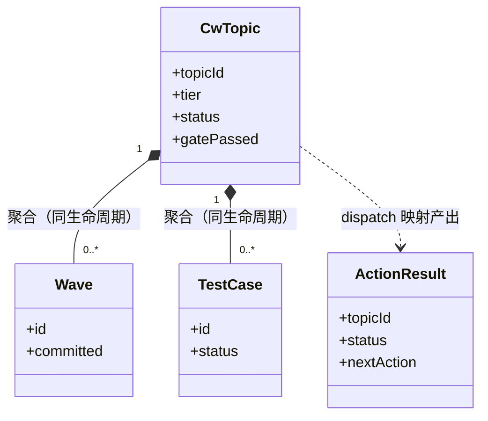
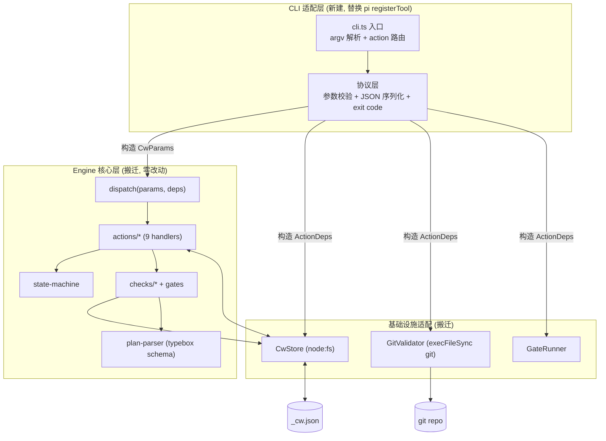
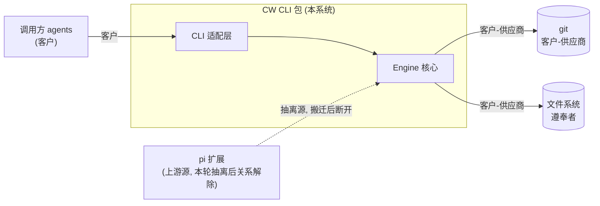
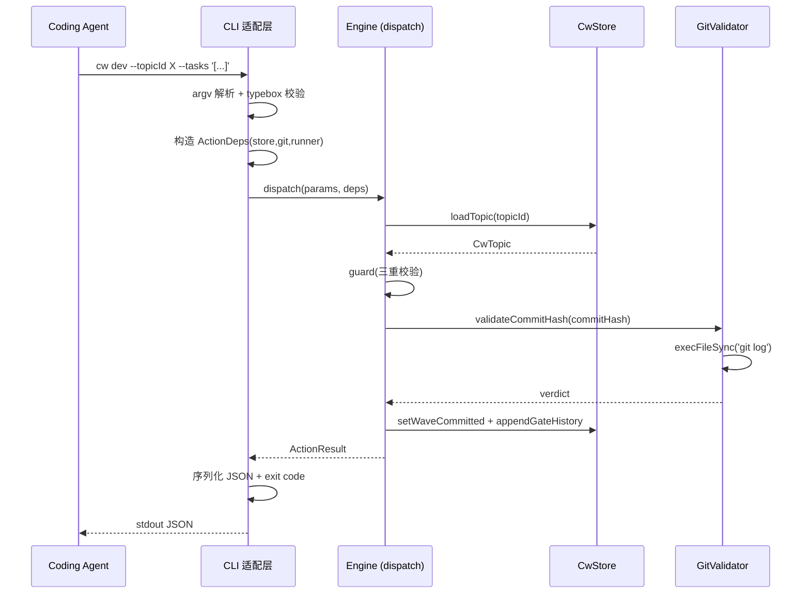

# coding-workflow engine 外置化 CLI — 架构设计

## 1. 目标转换

### 业务目标 → 系统目标
| 业务目标(requirements) | 转换为系统目标 | 衡量标准 |
|----------------------|--------------|---------|
| G1 engine 脱离 pi 独立运行 | 把 pi 适配层（src/index.ts registerTool 薄壳）替换为 CLI 适配层；engine 核心层零改动搬迁 | 运行时 import 图中无 pi 包 |
| G2 可被任意 agent 经子进程驱动 | 定义稳定的 CLI 协议：action→子命令、JSON stdio、exit code 语义 | 一个 agent 仅靠 spawn+读 JSON 走完完整流程 |
| G3 与现有 pi 扩展行为等价 | 复用 engine 源码 + 复用 typebox schema；测试套件迁移断言等价 | 抽离后单元测试全绿 + CLI e2e 覆盖完整 lite 流程 |

### 搭便车改造目标
| 改造目标 | 动机 | 关联业务目标 | 状态 |
|------|------|-------------|------|
| 存储路径参数化 | 当前 `resolveCwDbPath` 硬编码 `~/.pi/agent/cw/`，CLI 化必须脱离 pi 路径约定 | G1 | 已纳入（D-002：~/.cw/） |
| CwParamsSchema 信封下沉 | 当前 CwParamsSchema（action/topicId/slug/tier 等信封字段）定义在 index.ts，随 pi adapter 替换失去落脚点；业务 schema（LitePlanSchema 等）已在 plan-parser.ts 单源（index.ts 仅 import），无需下沉。信封下沉到 protocol.ts | G3 | 已纳入 |
| CLI 输出 = JSON.stringify(ActionResult) | renderSummary 是 pi TUI 专属文本（content[0].text），CLI 不碰不迁移；CLI 直接序列化 ActionResult.details 到 stdout | G2 | 已纳入 |

## 2. 设计立场

**核心计算是什么？** —— 状态机转换 + 机器检查 gate 执行。这是**技术流程编排**，不是复杂业务规则编排。

因此分层保持现有风格（不引入 DDD 4 层）：engine 已是清晰的三层结构（dispatch/handler → state-machine + checks → store/gates adapter）。本轮工作不是重新设计架构，而是**替换最外层适配层**（pi tool 注册 → CLI 入口），engine 三层原样搬迁。

一句话：**适配层替换，engine 不动**。

## 3. 统一语言（Ubiquitous Language）

引用项目根 `CONTEXT.md`。本节无新增术语（engine 领域模型搬迁，术语不变）。

## 4. 核心模型

> engine 领域模型已存在且稳定（types.ts），本轮**搬运不变**，不重新建模。下表是现有模型的确认，非新设计。

| 模型 | 类型 | 不变式 | 建模理由 |
|------|------|--------|---------|
| CwTopic | aggregate（根） | tier 写入后只读；status 按 TRANSITIONS 流转 | 编码任务生命周期单元 |
| CwStatus | 值对象（枚举） | 8 态有限集；closed 终态不可逆 | 状态机阶段 |
| Wave | 实体（CwTopic 内） | committed 一旦写入非空则不变（replan 为 append-only，已 committed 的 wave 不可删改，见 replan.ts） | dev 阶段渐进式提交单元 |
| TestCase | 实体（CwTopic 内） | status 只能 pending→passed/failed | test 阶段判定单元 |
| ActionResult | DTO | nextAction 非空 | engine 统一返回，CLI 序列化 |

### 模型关联图

### 降级决策（主动不建模）
| 概念 | 为什么不建模 | 应有的处理 |
|------|------------|-----------|
| CLI 参数对象 | 纯传输 DTO，无不变式 | 用 typebox schema 声明（复用 plan-parser） |
| 适配层配置 | 值对象（路径/env），无状态机 | 简单 config 加载函数 |

## 5. 状态流转

> 状态机已存在（state-machine.ts TRANSITIONS 表），**本轮零改动搬迁**。

### Status 枚举
created → planned/clarified → detailed(mid) → developed → tested → retrospected → closed

### Reason 字段（描述终态原因，与 Status 正交）
- **closed**（终态）的 Reason：`normal`（走完 create→closeout 全流程，gate 全 pass）或 `abandoned`（用户主动放弃，当前 engine 未实现此 Reason，CLI 轮同样不实现，仅标注）
- 其余非终态 Status 无独立 Reason（流转原因由 gateHistory 记录的 phase+result 表达，不需要正交 Reason 字段）
- 本轮 Reason 不新增实现（engine 零改动搬迁），仅在架构文档标注终态原因维度存在，供未来扩展

### 合法转换（声明式转换表摘要）
| action | expectedStatuses | nextStatus | progressive | requirePhaseComplete |
|--------|-----------------|-----------|-------------|---------------------|
| create | (无 topic) | created | — | — |
| plan | created | planned | — | — |
| clarify | created | clarified | — | — |
| detail | clarified | detailed | — | — |
| dev | planned/detailed/developed | developed | ✓ | — |
| test | developed/tested | tested | ✓ | dev |
| retrospect | tested/retrospected | retrospected | ✓ | test |
| closeout | retrospected | closed | — | — |
| replan | planned/developed | planned | ✓ | — |

> 三重 guard（checkLinear / checkPhaseCascade / checkCacheConsistency）行为不变，CLI 透传其 GuardVerdict。

## 6. 分层架构

### 层级图

### Port 清单
| Port | 价值定位 | 实现数 |
|------|---------|--------|
| **ActionDeps**（已存在） | engine 与副作用的唯一接缝：store/git/runner 注入 | 1（CwStore/GitValidator/GateRunner） |
| **CLI 协议边界**（新建，非 interface port） | engine 与调用方的接缝：CwParams in / ActionResult out / exit code。dispatch 签名即契约，当前不抽象为 interface（假设 seam，见 D-A） | 1（CLI 入口） |
| **存储路径解析**（新建，搭便车） | dbPath 的计算与 pi 路径约定解耦 | 1（~/.cw/，env CW_HOME 覆盖，D-002） |

> **Seam 判断（架构视角核心）：**
> - ActionDeps 是**真 seam**——store/git/runner 是真依赖（store 用 fs、git 用子进程），且测试已用 mock 证明可替换。保留。
> - CLI 协议 Port 当前**不抽象为多实现 interface**（本轮单形态，只一个 CLI 实现）。这是「假设 seam」——用户已确认 MCP 留后续，届时若新增 MCP 实现，再升格为真 port（两个实现=真 seam 的判定）。避免本轮过度设计。
> - 存储路径解析是真 seam（必须脱离 `~/.pi/`），但实现为纯函数 + config 即可，不需要 interface。

## 7. 模块划分与变化轴

| 模块 | 职责 | 变化轴 | LOC(预估) |
|------|------|--------|----------|
| `cli.ts`（新建） | argv 解析、action→handler 路由、ActionDeps 构造 | 调用方式（CLI/MCP 未来） | ~150 |
| `protocol.ts`（新建） | 参数校验（复用 typebox）、ActionResult→JSON、exit code 映射 | 输出格式 | ~80 |
| `dispatch + actions/*`（搬迁） | engine 入口 + 9 handler | 业务流程（稳定） | 现有不变 |
| `state-machine + checks + gates`（搬迁） | 状态转换 + 机器检查 | 校验规则（稳定） | 现有不变 |
| `store + plan-parser + types`（搬迁） | 持久化 + schema + 类型 | 数据契约（稳定） | 现有不变 |
| `resolveDbPath`（改写） | dbPath 计算，脱离 pi 路径 | 存储位置 | ~20 |

> **变化轴验证「适配层 vs engine」拆分合理性：** 适配层的变化轴是「调用方式/runtime」，engine 的变化轴是「业务流程/校验规则」——两者正交，拆分归位正确。这正是本轮把 CLI 适配层与 engine 核心层物理隔离的依据。

## 8. 系统间上下文边界（Context Map）

| 关联系统 | 关系模式 | 交互方式 | 契约稳定性 |
|---------|---------|---------|-----------|
| git | 客户-供应商（CW 是客户） | execFileSync | 稳定（GitValidator 封装） |
| 文件系统 | 客户-供应商 | node:fs | 稳定 |
| 调用方 agent | 客户-供应商（CW 提供协议） | 子进程+JSON stdio | 本轮定义 |
| pi 扩展 | 共享内核→抽离（一次性搬迁） | 源码搬迁 | 搬迁后断开 |

## 9. 泳道图（Swimlane）

## 10. 挑战与决策

### D-A: 适配层是否抽象为多 runtime port？
**张力**: 未来要支持 MCP，是否本轮就抽 `RuntimeAdapter` interface？
**决策**: 不抽象。本轮单 CLI 实现。
**理由**: 一个实现=假设 seam，两个才=真 seam（Seam 纪律）。用户已确认 MCP 留后续 topic。过早抽象会产生只有一个实现的 interface（Port≠interface 的反面教材）。MCP 落地时再升格。
**状态**: ✅ confirmed（D-不可逆，本轮取向已由用户 ask_user 确认收窄）

### D-B: 存储路径策略 ✅
**决策**: dbPath = `~/.cw/<encoded-cwd>/_cw.json`，env `CW_HOME` 可覆盖根目录。encodeCwd 逻辑复用。pi 现有数据留在 `~/.pi/agent/cw/` 不迁移，两工具数据隔离。
**理由**: 抽离成独立工具就该有独立数据空间；数据隔离干净避免迁移风险；pi 扩展若停用其数据自然废弃。
**状态**: confirmed by ask_user（D-002）

### D-C: CLI 协议风格 ✅
**决策**: 子命令风格（`cw create --slug X`）+ 大 JSON 字段（planJson/clarifyJson/detailJson）走 stdin pipe 或 `--xxx-json-file path`。exit code 映射 gate 结果。
**理由**: LLM 写子命令比构造 JSON payload 自然；stdin/文件双通道避命令行长度限制；人类可调试。否决 JSON-RPC 式（大 JSON 超长度+转义易错）。
**状态**: confirmed by ask_user（D-001）

### D-D: 大 JSON 字段传递机制 ✅
**决策**: 随 D-C 一并定——stdin pipe（`cw plan --topicId X < plan.json`）为主通道，`--plan-json-file path` 为显式文件通道。内联 `--plan-json '{...}'` 仅对极小 JSON 可选。
**状态**: confirmed（D-001 子决策）

### D-E: nextAction.skill 在非 pi agent 下的语义 ✅
**决策**: 原样透传 skill 字段，CLI 不额外处理（不文档化映射、不剥离）。
**理由**: 最小行为不改 engine；pi agent 用得上 skill 映射，非 pi agent 靠 nextAction.action + guidance 文本决策。CW 是状态机+gate 非 agent 教程，职责边界清晰。
**状态**: confirmed（D-可逆，agent-opinionated，D-005）

### D-F: ADR-029 worktree cwd 防护去向 ✅
**决策**: CLI adapter 继承 pi execute() 的 ADR-029 D1 防御——检测 process.cwd() 含 `.cw-wt/` 时拒绝 fallback，强制显式 --workspace 或 CW_WORKSPACE_ROOT env。
**张力**: 这是 pi-workflow-specific 防御（pi workflow 的 worktree 命名约定），通用 CLI 是否需要？
**理由**: 保留。成本极低（~10 行检测逻辑）；pi 仍是首个接入方，防御价值仍在；任意 agent 都可能在 worktree 里 spawn cw，静默丢弃会让 multi-workspace 用户重踩数据隔离坑（_cw.json 被隔离到错误的 encoded-cwd）。泛化为可配置 worktree-prefix 检测留后续。
**状态**: confirmed（D-可逆，agent-opinionated + reviewer HC-3 共识）

## 11. 反模式检查（grep 验收清单）

- [ ] engine 运行时 import 图无 `pi-coding-agent` / `pi-ai`（`grep -r "@mariozechner\|@earendil-works" src/` 仅命中注释或零命中）
- [ ] CLI 适配层未重复实现 engine 逻辑（dispatch/handler 直接复用，未 copy-paste 状态机/check）
- [ ] 未引入只有一个实现的 interface（RuntimeAdapter 在 MCP 落地前不创建）
- [ ] store/gates 行为零改动（现有单元测试全绿即证）
- [ ] StringEnum（@earendil-works/pi-ai）替换为 typebox Type.Union([Type.Literal(...)])，运行时无 pi-ai import
- [ ] exit code 分层契约实现（exit 0=正常含JSON / ≥1=程序错误+stderr）
- [ ] ADR-029 worktree cwd 防护逻辑搬迁（.cw-wt/ 检测 + 拒绝 fallback）
- [ ] CwParamsSchema 信封定义在 protocol.ts（非 index.ts），业务 schema 仍 import 自 plan-parser（单源）

## 决策记录

| id | 决策 | 来源 |
|----|------|------|
| D-A | 适配层不抽象多 runtime port（MCP 留后续） | §10 D-A |
| D-001 | CLI 协议子命令 + stdin/--xxx-file 传大 JSON | §10 D-C/D |
| D-002 | 存储路径 ~/.cw/，CW_HOME 覆盖，不迁移 pi 数据 | §10 D-B |
| D-003 | 独立 npm 包 bin=cw | §7 |
| D-004 | engine 单测原样 + CLI e2e | requirements UC-5 |
| D-005 | nextAction.skill 原样透传 | §10 D-E |

> 完整 rationale 见 `decisions.md`。

## 待确认

（Step 3 批量提问已全部解决，无残留项）
