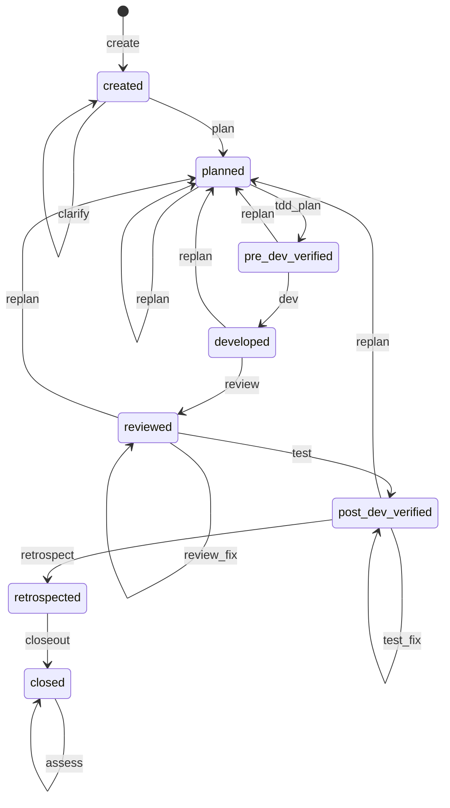

# 系统架构

> CW-CLI 当前态快照。架构决策的历史见 git log + ADR（如有）。
> 领域术语见 [CONTEXT.md](./CONTEXT.md)。

## 分层

```
┌─────────────────────────────────────────────┐
│  CLI 层 (cli.ts)                             │
│  argv 解析 → stdin → buildParams → dispatch  │
│  exit code 映射 + 只读查询（status/list/stats）│
├─────────────────────────────────────────────┤
│  Engine 层 (dispatch.ts)                     │
│  loadTopic → guard → handler → nextAction    │
│  对外纯函数入口，无 IO 副作用                  │
├──────────────┬──────────────┬───────────────┤
│ 状态机        │ Gate         │ 持久化         │
│ state-machine│ gate         │ store          │
│ .ts          │ .ts          │ .ts            │
│              │ + plan-parser│                │
├──────────────┴──────────────┴───────────────┤
│  Action Handlers (actions.ts)                │
│  13 个 handler，事务内 gate → store 变更      │
├─────────────────────────────────────────────┤
│  指标 (stats.ts) — 纯函数，只读 topic 数据    │
├─────────────────────────────────────────────┤
│  提示词 (prompts/*.ts) — 拼入 guidance 文本   │
└─────────────────────────────────────────────┘
```

数据流（单次 `cw <action>` 调用）：

```
agent bash 调 cw <action> [flags]
  → cli.ts: argv 解析 + stdin 读取 + buildParams 构造 CwParams
  → dispatch.ts: loadTopic → guard(action, topic) → handler(params, topic, deps)
  → handler: gate 检查 → 事务内 store 变更 → reload → buildNextAction
  → cli.ts: stdout JSON + exit code
```

## 模块划分

| 模块 | 职责 | 变化轴 |
|------|------|--------|
| `cli` | CLI 入口：argv 解析、stdin、buildParams、exit code、只读查询 | 新增 action 时加 buildParams case + VALID_DISPATCH_ACTIONS |
| `dispatch` | 统一入口：loadTopic → guard → handler 分派 → ActionResult | 新增 action 时加 switch case |
| `state-machine` | TRANSITIONS 表 + checkLinear guard + computeNextStatus + computeGatePassed + buildNextAction | 新增 action/status 时改 TRANSITIONS + buildNextAction |
| `actions` | 13 个 action handler + CwParams 联合类型 + gateAdvance 深函数 | 新增 action 时加 handler + Params 接口 |
| `gate` | 各 action 的 gate 检查函数 + GitValidator + CommitValidation | 新增 gate 类型时加检查函数 |
| `plan-parser` | dev-plan.json / test.json 解析（结构校验，非 typebox schema） | plan/test 格式变化时改解析 |
| `store` | JSON 文件持久化（flock + 原子写）+ TopicRecord CRUD | 新增 topic 字段时加 mapping |
| `stats` | 评估指标纯函数（complexity + efficiency + leverHealth + --all 聚合） | 新增指标时加 compute 函数 |
| `types` | 领域类型定义 + judgeByExpected 纯函数 | 核心契约，变更影响面大 |
| `prompts` | 7 个阶段提示词，拼入 buildNextAction 的 guidance | 阶段方法论变化时改 prompt |

## 关键状态机

CW 状态机定义在 `state-machine.ts` 的 `TRANSITIONS` 表中，8 个 status：



progressive action（dev/review/review_fix/test/test_fix/clarify/assess）可在同一 status 下多次调用。replan 从 planned~post_dev_verified 回退到 planned（append-only 约束）。

### fix loop（review / test）

review 和 test 各有独立的修复循环，不回退到 dev：

```
review: 发现 issues → review_fix → 重审（最多 3 轮）
  └ 达上限强制进 test，guidance 标注未修复的 must-fix

test: 有 case failed → test_fix → 重跑（最多 5 轮）
  └ 达上限熔断，建议 ask_user
```

## 外部依赖

| 类型 | 依赖 | 用途 |
|------|------|------|
| In-process | `minimist` | argv 解析（cli.ts） |
| Local-sub | `git`（子进程） | commit 存在性 + diff-tree 文件校验（gate.ts GitValidator） |
| Local-sub | 文件系统 | _cw.json 读写 + 交付物 gate（store.ts） |
| True-external | 无 | CW 不依赖任何远程服务 |

## gate 机制

gate 是 CW 的核心价值——不信任 agent 的声明，只信机器验证的证据：

| action | gate 名 | 校验内容 |
|--------|---------|---------|
| plan | lite-plan-schema | dev-plan.json 结构（format=lite + waves≥1 + 依赖无环 + 范围守门） |
| tdd_plan | tdd-red-light + test-json-schema | 红灯确认（测试文件 exit≠0）+ test.json 结构 |
| dev | medium-git | commit 存在 + commit 改动文件覆盖 plan 声明的文件 |
| review | file-exists+non-empty | review.md 存在 + 非空 |
| test | judgeByExpected | 机器按 expected 精确比较 actual（不信任 agent 声明的 status） |
| retrospect | file-exists+non-empty | retrospect.md 存在 + 非空 |
| closeout | topicDir-exists | topic 目录存在 |
| replan | append-only-validator | 已 committed wave / 已 passed testCase 不可删改 |

## 评估指标架构

三层指标，详见 [docs/metrics-design.md](./docs/metrics-design.md)：

| 层 | 数据来源 | 计算函数 | 采集时机 |
|----|---------|---------|---------|
| 交付质量 | retrospectData + assessments | retrospect 阶段 + assess（post-closeout） | retrospect/closeout 后 |
| 过程效率 | gateHistory + waves + testCases | `stats.ts` computeEfficiency | 全程自动 |
| 杠杆健康度 | gateHistory（按 gate 名分组） | `stats.ts` computeLeverHealth | 全程自动 |

所有指标计算都是纯函数（只读 topic 数据，无副作用）。跨 topic 聚合按 RuntimeEnv 分组 + 复杂度分桶。
