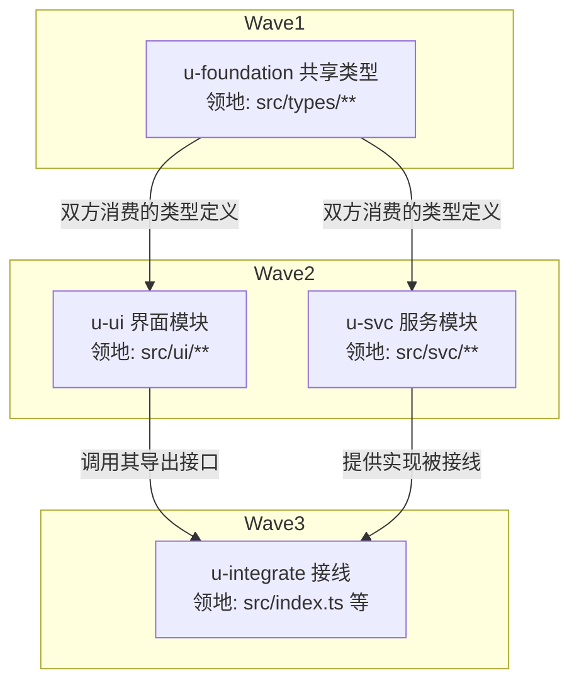

# DAG 编写规范

> 服务 `flow/plan.md` 阶段 1。回答四个问题：单元怎么切、边怎么连、worktree 何时开、图怎么画。

## 单元切分判据

- 单个 dev subagent 可独立完成：规模 ≤5 文件 / ~3000 行（与全局 subagent 约束一致）
- 验收条款客观可判：命令能跑、输出可比、效果可见
- 领地可枚举到精确文件路径；枚不出来的单元 = 拆分不成熟，继续拆
- **共享接线点集中律**：被多个单元消费的类型/接口/契约模块 → 独立设为 `u-foundation` 根节点，串行先行。禁止并行单元同时编辑共享契约文件

## 边的判定

| 关系 | 结论 |
|------|------|
| 先写后读 / 接口复用 / 同文件共改 | 串行边 |
| 领地互斥且无数据依赖 | 可并行，同波次 |
| 其余拿不准 | 默认加串行边（保守正确），运行期观察后再松绑 |

波次由拓扑分层推导：同层即一波（≤5 个），整波绿才开下一波。

## worktree 决策表

满足任一条才开 worktree，否则一律 plain（领地互斥已足够安全，worktree 有建立/合并/清理成本）：

| 条件 | 说明 |
|------|------|
| 触碰热点公共文件 ≥1 | 如全局路由表、index 出口、共享 store——冲突面大 |
| 实验性大改、可能整体废弃 | 失败时直接弃置，不污染工作分支 |
| 用户指定 | 用户要求优先 |

计划表 `隔离` 列必须标注；执行差异见 execute.md「worktree 单元的差异」。

## mermaid 画法

正例（子图分层 + 边带原因 + 领地入节点）：

反例（出现即返工）：

- 假并行：两个单元都改 `src/index.ts` 却画成无边平行——调度器会放同一波造成写冲突
- 边不带原因：后续无法审查「这条依赖是否还成立」
- 领地含糊（只写「前端相关」）→ 无法生成 add 白名单与互斥判定
- 无验收条款列 → 执行期验收条款现编，回溯断裂

## 写盘前自检清单

- [ ] 任意两单元领地交集为空
- [ ] 每条边有原因标注
- [ ] u-foundation 存在且为根（确无共享契约时才允许缺席）
- [ ] 每行验收条款独立可判
- [ ] 波次数与并发 ≤5 兼容
- [ ] 隔离列与热点文件分析一致
